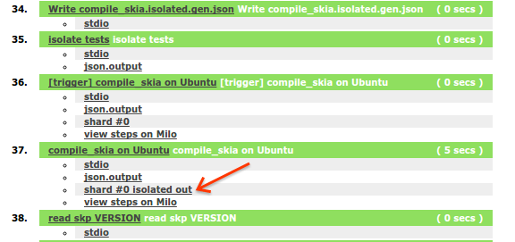
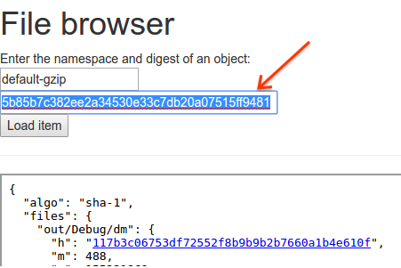

Downloading Isolates
====================

The intermediate and final build products from running tests are all stored in
[Isolate](https://github.com/luci/luci-py/blob/master/appengine/isolate/doc/Design.md),
and can be downloaded to the desktop for inspection and debugging.

First install the client:

     git clone https://github.com/luci/client-py.git

Add the checkout location to your $PATH.

To download the isolated files for a test first visit
the build status page and find the "isolated output" link:

Follow that link to find the hash of the isolated outputs:

Then run `isolateserver.py` with --isolated set to that hash:

    $ isolateserver.py \
      download \
      --isolate-server=https://isolateserver.appspot.com \
      --isolated=5b85b7c382ee2a34530e33c7db20a07515ff9481 \
      --target=./download/

