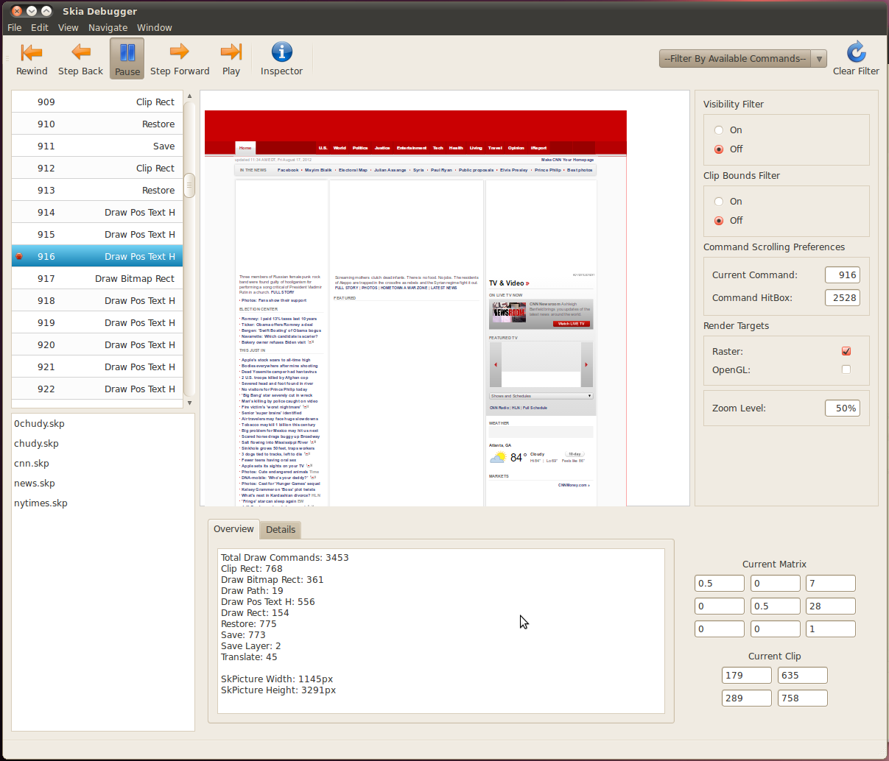

Skia Debugger
=============

Introduction
------------

The Skia Debugger is a graphical tool used to step through and analyze the
contents of the Skia picture format. Pre-requisites include installing the Qt
Library and downloading the Skia code base.

Qt is available here: http://qt-project.org/downloads.

It can also be installed on linux using 

<!--?prettify?-->
~~~~
sudo apt-get install libqt4-dev
~~~~

Note that the debugger has been tested with Qt 4.8.6; it is known not to work
with Qt 5.0RC1 on the Mac.

Design Documents:

https://docs.google.com/a/google.com/document/d/1b8muqVzfbJmYbno9nTv5721V2nlFMfnqXYLNHiSQ4ws/pub

How to build and run
--------------------

Because the debugger uses Qt, you'll need to build skia in 64 bit mode:

<!--?prettify?-->

    GYP_DEFINES="skia_arch_width=64" python bin/sync-and-gyp
    ninja -C out/Debug debugger
    out/Debug/debugger

For Windows, Qt ships as 32 bit libraries so to build and run one should just be
able to:

<!--?prettify?-->
~~~~
cd trunk
make clean gyp
<open solution in VS2010 and build everything>
~~~~

Depending on how your Qt is installed you may also need to define an environment
variable like: 

~~~~
GYP_DEFINES=qt_sdk='C:\Qt\4.8.6\'
~~~~
(which needs to be set before you execute 'make gyp')

On Windows, you may need to copy several DLL and PDB files from %QTDIR%\bin into
your executable directory (out/Debug or out/Release):

QtCore4.dll QtCored4.dll QtCored4.pdb

QtGui4.dll QtGuid4.dll QtGuid4.pdb

QtOpenGL4.dll QtOpenGLd4.dll QtOpenGLd4.pdb 

Producing SKPs for usage
------------------------

You may either use the Skia testing images (GMs) for use in the debugger or
create your own via chromium.

To create SKPs from Chromium you must download and build chromium on your
platform of choice: http://www.chromium.org/Home

<!--?prettify?-->
~~~~
cd src
make chrome
out/Debug/chrome --no-sandbox --enable-gpu-benchmarking --force-compositing-mode
~~~~

After which go to Tools, Settings, Javascript Console and type:

<!--?prettify?-->
~~~~
chrome.gpuBenchmarking.printToSkPicture(dirname)
~~~~

Using the Debugger
------------------

The debugger is fairly straight forward to use once a picture is loaded in. We
can step through different commands via the up and down keys, and clicking on
the command in the list. We can pause execution of commands with the pause
button in order to inspect the details of the command in the inspector tabs
down below.

 
 Command      | Function
 -------------|-----------------------------------------------
 x            | toggles the visibility of the selected command
 alt-x        | clears all hidden commands
 ctrl-x       | shows all deleted commands
 b            | creates a breakpoint on a command
 alt-b        | clears all breakpoints
 ctrl-b       | shows all breakpoints
 ctrl-r       | rewinds the picture to the first command
 ctrl-p       | plays to the next breakpoint or last command
 ctrl-i       | Toggles the inspector and settings widgets
 ctrl-d       | Toggles the directory widget
 space        | Pauses drawing execution
 ctrl-o       | Opens a file dialog for loading pictures
 ctrl-s       | Saves the skp if you deleted any commands
 ctrl-shift-s | Saves the skp under the new specified name
 ctrl-q       | Quits

