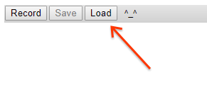

Tracing Skia Execution
======================

Introduction
------------

Skia is instrumented to provide execution traces in several ways. Within Chrome, Skia is traced
with the standard [tracing interface](chrome://tracing), along with the rest of Chromium. In
the Android framework, Skia's tracing is integrated into
[atrace](https://source.android.com/devices/tech/debug/ftrace).

For standalone builds, Skia's tools (DM, nanobench, and Viewer) are capable of tracing execution
in three ways, controlled by the `--trace` command line argument.

Android ATrace
--------------

Running any tool with `--trace atrace` on an Android device will cause the application to forward
tracing information to [atrace](https://source.android.com/devices/tech/debug/ftrace). On other
platforms, this has no effect.

If you run `systrace` from the host command line, you will need to supply `-a <app_name>`,
and the `<app_name>` argument will need to exactly match the command line used on the target
device. For example, if you use `adb shell "cd /data/local/tmp; ./nanobench --trace atrace ..."`
you must pass `-a ./nanobench` or systrace will ignore events from the application.

Console Logging
---------------

For simple situations, all tracing events can be directed to the console with `--trace debugf`:

<!--?prettify lang=sh?-->

    # Run DM on a single GM with SkDebugf tracing
    out/Release/dm --config gl --match ^gamma$ --trace debugf

~~~
[ 0] <skia.gpu> GrDrawingManager::internalFlush id=1 #0 {
[ 0] } GrDrawingManager::internalFlush
[ 0] <skia.gpu> GrGpu::createTexture id=1 #1 {
[ 0] } GrGpu::createTexture
[ 0] <skia.gpu> GrRenderTargetContext::discard id=1 #2 {
[ 0] } GrRenderTargetContext::discard
[ 0] <skia.gpu> SkGpuDevice::clearAll id=1 #3 {
[ 1]  <skia.gpu> GrRenderTargetContext::clear id=1 #4 {
[ 1]  } GrRenderTargetContext::clear
[ 0] } SkGpuDevice::clearAll
[ 0] <skia> SkCanvas::drawRect() #5 {
[ 1]  <skia.gpu> SkGpuDevice::drawRect id=1 #6 {
[ 2]   <skia.gpu> GrRenderTargetContext::drawRect id=1 #7 {
[ 3]    <skia.gpu> GrRenderTargetContext::addDrawOp id=1 #8 {
[ 3]    } GrRenderTargetContext::addDrawOp
[ 2]   } GrRenderTargetContext::drawRect
[ 1]  } SkGpuDevice::drawRect
[ 0] } SkCanvas::drawRect()
...
~~~

Chrome Tracing
--------------

Any other argument to `--trace` will be interpreted as a filename, and trace events will be written
to that file in JSON format, suitable for viewing with [chrome://tracing](chrome://tracing).

<!--?prettify lang=sh?-->

    # Run DM on several GMs to get tracing data
    out/Release/dm --config gl --match bleed --trace gl_bleed_gms.json

This creates a file `gl_bleed_gms.json` in the current directory. Go to
[chrome://tracing](chrome://tracing), click Load:

... then select the JSON file. The data will be loaded and can be navigated/inspected using the
tracing tools. Tip: press '?' for a help screen explaining the available keyboard and mouse
controls.

