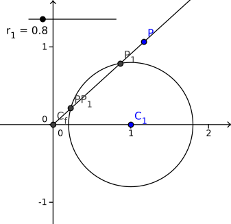
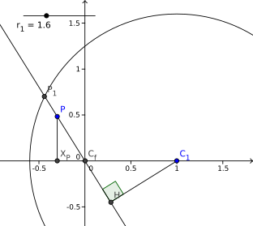
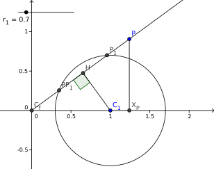

(Please refresh the page if you see a lot of dollars instead of math symbols.)

We present a fast shading algorithm (compared to bruteforcely solving the
quadratic equation of gradient $t$) for computing the two-point conical gradient
(i.e., `createRadialGradient` in
[spec](https://html.spec.whatwg.org/multipage/canvas.html#dom-context-2d-createradialgradient)).
It reduced the number of multiplications per pixel from ~10 down to 3, and
brought a speedup of up to 26% in our nanobenches.

This document has 3 parts:

1. Problem Statement and Setup
2. Algorithm
3. Appendix

Part 1 and 2 are self-explanatory. Part 3 shows how to geometrically proves our
Theorem 1 in part 2; it's more complicated but it gives us a nice picture about
what's going on.

## Problem Statement and Setup

Let two circles be $C_0, r_0$ and $C_1, r_1$ where $C$ is the center and $r$ is
the radius. For any point $P = (x, y)$ we want the shader to quickly compute a
gradient $t \in \mathbb R$ such that $p$ is on the linearly interpolated circle
with center $C_t = (1-t) \cdot C_0 + t \cdot C_1$ and radius
$r_t = (1-t) \cdot r_0 + t \cdot r_1 > 0$ (note that radius $r_t$ has to be
_positive_). If there are multiple (at most 2) solutions of $t$, choose the
bigger one.

There are two degenerated cases:

1. $C_0 = C_1$ so the gradient is essentially a simple radial gradient.
2. $r_0 = r_1$ so the gradient is a single strip with bandwidth $2 r_0 = 2 r_1$.

<!-- TODO maybe add some fiddle or images here to illustrate the two degenerated cases -->

They are easy to handle so we won't cover them here. From now on, we assume
$C_0 \neq C_1$ and $r_0
\neq r_1$.

As $r_0 \neq r_1$, we can find a focal point
$C_f = (1-f) \cdot C_0 + f \cdot C_1$ where its corresponding linearly
interpolated radius $r_f = (1-f) \cdot r_0 + f \cdot r_1 = 0$. Solving the
latter equation gets us $f = r_0 / (r_0 - r_1)$.

As $C_0 \neq C_1$, focal point $C_f$ is different from $C_1$ unless $r_1 = 0$.
If $r_1 = 0$, we can swap $C_0, r_0$ with $C_1, r_1$, compute swapped gradient
$t_s$ as if $r_1 \neq 0$, and finally set $t = 1 - t_s$. The only catch here is
that with multiple solutions of $t_s$, we shall choose the smaller one (so $t$
could be the bigger one).

Assuming that we've done swapping if necessary so $C_1 \neq C_f$, we can then do
a linear transformation to map $C_f, C_1$ to $(0, 0), (1, 0)$. After the
transformation:

1. All centers $C_t = (x_t, 0)$ must be on the $x$ axis
2. The radius $r_t$ is $x_t r_1$.
3. Given $x_t$ , we can derive $t = f + (1 - f) x_t$

From now on, we'll focus on how to quickly computes $x_t$. Note that $r_t > 0$
so we're only interested positive solution $x_t$. Again, if there are multiple
$x_t$ solutions, we may want to find the bigger one if $1 - f > 0$, and smaller
one if $1 - f < 0$, so the corresponding $t$ is always the bigger one (note that
$f \neq 1$, otherwise we'll swap $C_0, r_0$ with $C_1, r_1$).

## Algorithm

**Theorem 1.** The solution to $x_t$ is

1. $\frac{x^2 + y^2}{(1 + r_1) x} = \frac{x^2 + y^2}{2 x}$ if $r_1 = 1$
2. $\left(\sqrt{(r_1^2 - 1) y ^2 + r_1^2 x^2}  - x\right) / (r_1^2 - 1)$ if
   $r_1 > 1$
3. $\left(\pm \sqrt{(r_1^2 - 1) y ^2 + r_1^2 x^2}  - x\right) / (r_1^2 - 1)$ if
   $r_1 < 1$.

Case 2 always produces a valid $x_t$. Case 1 and 3 requires $x > 0$ to produce
valid $x_t > 0$. Case 3 may have no solution at all if
$(r_1^2 - 1) y^2 + r_1^2 x^2 < 0$.

_Proof._ Algebriacally, solving the quadratic equation
$(x_t - x)^2 + y^2 = (x_t r_1)^2$ and eliminate negative $x_t$ solutions get us
the theorem.

Alternatively, we can also combine Corollary 2., 3., and Lemma 4. in the
Appendix to geometrically prove the theorem. $\square$

Theorem 1 by itself is not sufficient for our shader algorithm because:

1. we still need to compute $t$ from $x_t$ (remember that $t = f + (1-f) x_t$);
2. we still need to handle cases of choosing the bigger/smaller $x_t$;
3. we still need to handle the swapped case (we swap $C_0, r_0$ with $C_1, r_1$
   if $r_1 = 0$);
4. there are way too many multiplications and divisions in Theorem 1 that would
   slow our shader.

Issue 2 and 3 are solved by generating different shader code based on different
situations. So they are mainly correctness issues rather than performance
issues. Issue 1 and 4 are performance critical, and they will affect how we
handle issue 2 and 3.

The key to handle 1 and 4 efficiently is to fold as many multiplications and
divisions into the linear transformation matrix, which the shader has to do
anyway (remember our linear transformation to map $C_f, C_1$ to
$(0, 0), (1, 0)$).

For example, let $\hat x, \hat y = |1-f|x, |1-f|y$. Computing $\hat x_t$ with
respect to $\hat x,
\hat y$ allow us to have
$t = f + (1 - f)x_t = f + \text{sign}(1-f) \cdot \hat x_t$. That saves us one
multiplication. Applying similar techniques to Theorem 1 gets us:

1. If $r_1 = 1$, let $x' = x/2,~ y' = y/2$, then $x_t = (x'^2 + y'^2) / x'$.
2. If $r_1 > 1$, let
   $x' = r_1 / (r_1^2 - 1) x,~ y' = \frac{\sqrt{r_1^2 - 1}}{r_1^2 - 1} y$, then
   $x_t = \sqrt{x'^2 + y'^2} - x' / r_1$
3. If $r_1 < 1$, let
   $x' = r_1 / (r_1^2 - 1) x,~ y' = \frac{\sqrt{1 - r_1^2}}{r_1^2 - 1} y$, then
   $x_t = \pm\sqrt{x'^2 - y'^2} - x' / r_1$

Combining it with the swapping, the equation $t = f + (1-f) x_t$, and the fact
that we only want positive $x_t > 0$ and bigger $t$, we have our final
algorithm:

**Algorithm 1.**

1. Let $C'_0, r'_0, C'_1, r'_1 = C_0, r_0, C_1, r_1$ if there is no swapping and
   $C'_0,
    r'_0, C'_1, r'_1 = C_1, r_1, C_0, r_0$ if there is swapping.
2. Let $f = r'_0 / (r'_0 - r'_1)$ and $1 - f = r'_1 / (r'_1 - r'_0)$
3. Let $x' = x/2,~ y' = y/2$ if $r_1 = 1$, and
   $x' = r_1 / (r_1^2 - 1) x,~ y' = \sqrt{|r_1^2 - 1|} / (r_1^2 - 1) y$ if
   $r_1 \neq 1$
4. Let $\hat x = |1 - f|x', \hat y = |1 - f|y'$
5. If $r_1 = 1$, let $\hat x_t = (\hat x^2 + \hat y^2) / \hat x$
6. If $r_1 > 1$, let $\hat x_t = \sqrt{\hat x^2 + \hat y^2} - \hat x / r_1$
7. If $r_1 < 1$
8. return invalid if $\hat x^2 - \hat y^2 < 0$
9. let $\hat x_t =  -\sqrt{\hat x^2 - \hat y^2} - \hat x / r_1$ if we've swapped
   $r_0, r_1$, or if $1 - f < 0$

10. let $\hat x_t =  \sqrt{\hat x^2 - \hat y^2} - \hat x / r_1$ otherwise

11. $t$ is invalid if $\hat x_t < 0$ (this check is unnecessary if $r_1 > 1$)
12. Let $t = f + \text{sign}(1 - f) \hat x_t$
13. If swapped, let $t = 1 - t$

In step 7, we try to select either the smaller or bigger $\hat x_t$ based on
whether the final $t$ has a negative or positive relationship with $\hat x_t$.
It's negative if we've swapped, or if $\text{sign}(1 - f)$ is negative (these
two cannot both happen).

Note that all the computations and if decisions not involving $\hat x, \hat y$
can be precomputed before the shading stage. The two if decisions
$\hat x^2 - \hat y^2 < 0$ and $\hat x^t < 0$ can also be omitted by precomputing
the shading area that never violates those conditions.

The number of operations per shading is thus:

- 1 addition, 2 multiplications, and 1 division if $r_1 = 1$
- 2 additions, 3 multiplications, and 1 sqrt for $r_1 \neq 1$ (count subtraction
  as addition; dividing $r_1$ is multiplying $1/r_1$)
- 1 more addition operation if $f \neq 0$
- 1 more addition operation if swapped.

In comparison, for $r_1 \neq 1$ case, our current raster pipeline shading
algorithm (which shall hopefully soon be upgraded to the algorithm described
here) mainly uses formula

$$
t = 0.5 \cdot
(1/a) \cdot \left(-b \pm \sqrt{b^2 - 4ac}\right)$$ It precomputes
$a = 1 - (r_1 - r_0)^2, 1/a, r1 -
r0$. Number
$b = -2 \cdot (x + (r1 - r0) \cdot r0)$ costs 2 multiplications and 1 addition.
Number $c = x^2 + y^2 - r_0^2$ costs 3 multiplications and 2 additions. And the
final $t$ costs 5 more multiplications, 1 more sqrt, and 2 more additions.
That's a total of 5 additions, 10 multiplications, and 1 sqrt. (Our algorithm
has 2-4 additions, 3 multiplications, and 1 sqrt.) Even if it saves the
$0.5 \cdot (1/a), 4a, r_0^2$ and $(r_1 - r_0) r_0$ multiplications, there are
still 6 multiplications. Moreover, it sends in 4 unitofmrs to the shader while
our algorithm only needs 2 uniforms ($1/r_1$ and $f$).

## Appendix

**Lemma 1.** Draw a ray from $C_f = (0, 0)$ to $P = (x, y)$. For every
intersection points $P_1$ between that ray and circle $C_1 = (1, 0), r_1$, there
exists an $x_t$ that equals to the length of segment $C_f P$ over length of
segment $C_f P_1$. That is, $x_t = || C_f P || / ||C_f P_1||$

_Proof._ Draw a line from $P$ that's parallel to $C_1 P_1$. Let it intersect
with $x$-axis on point $C = (x', y')$.

Triangle $\triangle C_f C P$ is similar to triangle $\triangle C_f C_1 P_1$.
Therefore $||P C|| = ||P_1 C_1|| \cdot (||C_f C|| / ||C_f C_1||) = r_1 x'$. Thus
$x'$ is a solution to $x_t$. Because triangle $\triangle C_f C P$ and triangle
$\triangle C_f C_1 P_1$ are similar,
$x'
= ||C_f C_1|| \cdot (||C_f P|| / ||C_f P_1||) = ||C_f P|| / ||C_f P_1||$.
$\square$

**Lemma 2.** For every solution $x_t$, if we extend/shrink segment $C_f P$ to
$C_f P_1$ with ratio $1 / x_t$ (i.e., find $P_1$ on ray $C_f P$ such that
$||C_f P_1|| / ||C_f P|| = 1 / x_t$), then $P_1$ must be on circle $C_1, r_1$.

_Proof._ Let $C_t = (x_t, 0)$. Triangle $\triangle C_f C_t P$ is similar to
$C_f C_1 P_1$. Therefore $||C_1 P_1|| = r_1$ and $P_1$ is on circle $C_1, r_1$.
$\square$

**Corollary 1.** By lemma 1. and 2., we conclude that the number of solutions
$x_t$ is equal to the number of intersections between ray $C_f P$ and circle
$C_1, r_1$. Therefore

- when $r_1 > 1$, there's always one unique intersection/solution; we call this
  "well-behaved"; this was previously known as the "inside" case;
- when $r_1 = 1$, there's either one or zero intersection/solution (excluding
  $C_f$ which is always on the circle); we call this "focal-on-circle"; this was
  previously known as the "edge" case;

- when $r_1 < 1$, there may be $0, 1$, or $2$ solutions; this was also
  previously as the "outside" case.

**Lemma 3.** When solution exists, one such solution is

$$

    x_t = {|| C_f P || \over ||C_f P_1||} = \frac{x^2 + y^2}{x + \sqrt{(r_1^2 - 1) y^2 + r_1^2 x^2}}

$$

_Proof._ As $C_f = (0, 0), P = (x, y)$, we have $||C_f P|| = \sqrt(x^2 + y^2)$.
So we'll mainly focus on how to compute $||C_f P_1||$.

**When $x \geq 0$:**

Let $X_P = (x, 0)$ and $H$ be a point on $C_f P_1$ such that $C_1 H$ is
perpendicular to $C_1
P_1$. Triangle $\triangle C_1 H C_f$ is similar to triangle
$\triangle P X_P C_f$. Thus
$$||C_f H|| = ||C_f C_1|| \cdot (||C_f X_P|| / ||C_f P||) = x / \sqrt{x^2 + y^2}$$
$$||C_1 H|| = ||C_f C_1|| \cdot (||P X_P|| / ||C_f P||) = y / \sqrt{x^2 + y^2}$$

Triangle $\triangle C_1 H P_1$ is a right triangle with hypotenuse $r_1$. Hence
$$ ||H P_1|| = \sqrt{r_1^2 - ||C_1 H||^2} = \sqrt{r_1^2 - y^2 / (x^2 + y^2)} $$

We have \begin{align} ||C_f P_1|| &= ||C_f H|| + ||H P_1|| \\\\\\ &= x /
\sqrt{x^2 + y^2} + \sqrt{r_1^2 - y^2 / (x^2 + y^2)} \\\\\\ &= \frac{x +
\sqrt{r_1^2 (x^2 + y^2) - y^2}}{\sqrt{x^2 + y^2}} \\\\\\ &= \frac{x +
\sqrt{(r_1^2 - 1) y^2 + r_1^2 x^2}}{\sqrt{x^2 + y^2}} \end{align}

**When $x < 0$:**

Define $X_P$ and $H$ similarly as before except that now $H$ is on ray $P_1 C_f$
instead of $C_f P_1$.

As before, triangle $\triangle C_1 H C_f$ is similar to triangle
$\triangle P X_P C_f$, and triangle $\triangle C_1 H P_1$ is a right triangle,
so we have
$$||C_f H|| = ||C_f C_1|| \cdot (||C_f X_P|| / ||C_f P||) = -x / \sqrt{x^2 + y^2}$$
$$||C_1 H|| = ||C_f C_1|| \cdot (||P X_P|| / ||C_f P||) = y / \sqrt{x^2 + y^2}$$
$$ ||H P_1|| = \sqrt{r_1^2 - ||C_1 H||^2} = \sqrt{r_1^2 - y^2 / (x^2 + y^2)} $$

Note that the only difference is changing $x$ to $-x$ because $x$ is negative.

Also note that now $||C_f P_1|| = -||C_f H|| + ||H P_1||$ and we have
$-||C_f H||$ instead of $||C_f H||$. That negation cancels out the negation of
$-x$ so we get the same equation of $||C_f P_1||$ for both $x \geq 0$ and
$x < 0$ cases:

$$

    ||C_f P_1|| = \frac{x + \sqrt{(r_1^2 - 1) y^2 + r_1^2 x^2}}{\sqrt{x^2 + y^2}}

$$

Finally

$$

    x_t = \frac{||C_f P||}{||C_f P_1||} = \frac{\sqrt{x^2 + y^2}}{||C_f P_1||}
        = \frac{x^2 + y^2}{x + \sqrt{(r_1^2 - 1) y^2 + r_1^2 x^2}}

$$ $\square$

**Corollary 2.** If $r_1 = 1$, then the solution
$x_t = \frac{x^2 + y^2}{(1 + r_1) x}$, and it's valid (i.e., $x_t > 0$) iff
$x > 0$.

_Proof._ Simply plug $r_1 = 1$ into the formula of Lemma 3. $\square$

**Corollary 3.** If $r_1 > 1$, then the unique solution is
$x_t = \left(\sqrt{(r_1^2 - 1) y ^2 + r_1^2 x^2}  - x\right) / (r_1^2 - 1)$.

_Proof._ From Lemma 3., we have

\begin{align} x_t &= \frac{x^2 + y^2}{x + \sqrt{(r_1^2 - 1) y^2 + r_1^2 x^2}}
\\\\\\ &= { (x^2 + y^2) \left ( -x + \sqrt{(r_1^2 - 1) y^2 + r_1^2 x^2} \right )
\over \left (x + \sqrt{(r_1^2 - 1) y^2 + r_1^2 x^2} \right ) \left (-x +
\sqrt{(r_1^2 - 1) y^2 + r_1^2 x^2} \right ) } \\\\\\ &= { (x^2 + y^2) \left (
-x + \sqrt{(r_1^2 - 1) y^2 + r_1^2 x^2} \right ) \over -x^2 + (r_1^2 - 1) y^2 +
r_1^2 x^2 } \\\\\\ &= { (x^2 + y^2) \left ( -x + \sqrt{(r_1^2 - 1) y^2 + r_1^2
x^2} \right ) \over (r_1^2 - 1) (x^2 + y^2) } \\\\\\ &= \left(\sqrt{(r_1^2 - 1)
y ^2 + r_1^2 x^2} - x\right) / (r_1^2 - 1) \end{align}

The transformation above (multiplying $-x + \sqrt{(r_1^2 - 1) y^2 + r_1^2 x^2}$
to enumerator and denomenator) is always valid because $r_1 > 1$ and it's the
unique solution due to Corollary 1. $\square$

**Lemma 4.** If $r_1 < 1$, then

1. there's no solution to $x_t$ if $(r_1^2 - 1) y^2 + r_1^2 x^2 < 0$
2. otherwise, the solutions are
   $x_t = \left(\sqrt{(r_1^2 - 1) y ^2 + r_1^2 x^2}  - x\right) / (r_1^2 - 1)$,
   or
   $x_t = \left(-\sqrt{(r_1^2 - 1) y ^2 + r_1^2 x^2}  - x\right) / (r_1^2 - 1)$.

(Note that solution $x_t$ still has to be nonnegative to be valid; also note
that $x_t > 0 \Leftrightarrow x > 0$ if the solution exists.)

_Proof._ Case 1 follows naturally from Lemma 3. and Corollary 1.

For case 2, we notice that $||C_f P_1||$ could be

1. either $||C_f H|| + ||H P_1||$ or $||C_f H|| - ||H P_1||$ if $x \geq 0$,
2. either $-||C_f H|| + ||H P_1||$ or $-||C_f H|| - ||H P_1||$ if $x < 0$.

By analysis similar to Lemma 3., the solution to $x_t$ does not depend on the
sign of $x$ and they are either
$\frac{x^2 + y^2}{x + \sqrt{(r_1^2 - 1) y^2 + r_1^2 x^2}}$ or
$\frac{x^2 + y^2}{x - \sqrt{(r_1^2 - 1) y^2 + r_1^2 x^2}}$.

As $r_1 \neq 1$, we can apply the similar transformation in Corollary 3. to get
the two formula in the lemma. $\square$

$$
$$
