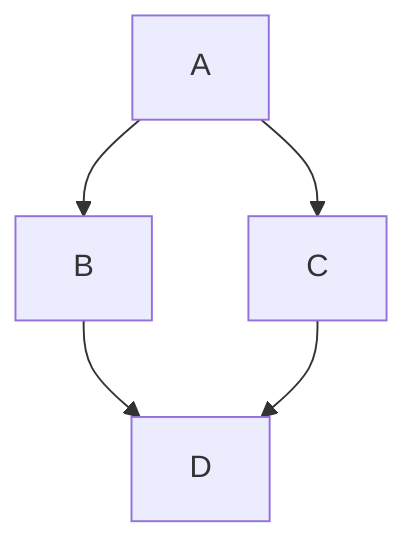

This site is build with [Hugo](https://gohugo.io/) and
[Docsy](https://www.docsy.dev/).

Any file you put under `/site/` that has the extension `.md` will be processed
as Markdown. All other files will be served directly. For example, images can be
added and they will be served correctly and referenced from within Markdown
files.

When preparing for a code review of site docs you can get a preview of how the
page will render by visiting the skia.org site and add a query parameter `cl`
with the value of the Reitveld issue id:

    https://skia.org/path/to/markdown-file?cl=REITVELD_ISSUE_NUMBER

See the [Docsy documentation](https://www.docsy.dev/docs/) for more details on
how to configure and use docsy. For example the
[Navigation](https://www.docsy.dev/docs/adding-content/navigation/) section
explains what frontmatter needs to be added to a page to get it to appear in the
top navigation bar.

## Frontmatter

Each page needs a frontmatter section that provides information on that page.
For example:

```
---
title: 'Markdown'
linkTitle: 'Markdown'
---
```

This is true for both Markdown and HTML pages. See
[the Docsy documentation on frontmatter](https://www.docsy.dev/docs/adding-content/content/#page-frontmatter)
for more details.

## Styling And Icons

Docsy supports both
[Bootstrap](https://getbootstrap.com/docs/5.0/getting-started/introduction/) and
[Font-Awesome](https://fontawesome.com/). Check out their documentation for what
they offer.

Bootstrap is huge and powerful, you will need to really read the documentation,
but here are a few examples of what's possible:

<div id="carouselExampleControls" class="carousel slide" data-bs-ride="carousel">
  <div class="carousel-inner">
    <div class="carousel-item active">
      
    </div>
    <div class="carousel-item">
      
    </div>
    <div class="carousel-item">
      
    </div>
  </div>
  <button class="carousel-control-prev" type="button" data-bs-target="#carouselExampleControls" data-bs-slide="prev">
    <span class="carousel-control-prev-icon" aria-hidden="true"></span>
    <span class="visually-hidden">Previous</span>
  </button>
  <button class="carousel-control-next" type="button" data-bs-target="#carouselExampleControls" data-bs-slide="next">
    <span class="carousel-control-next-icon" aria-hidden="true"></span>
    <span class="visually-hidden">Next</span>
  </button>
</div>

[Definition Lists](https://getbootstrap.com/docs/5.0/content/typography/#description-list-alignment)

<dl class="row">
  <dt class="col-sm-3">Description lists</dt>
  <dd class="col-sm-5">A description list is perfect for defining terms.</dd>

  <dt class="col-sm-3">Term</dt>
  <dd class="col-sm-5">
    <p>Definition for the term.</p>
    <p>And some more placeholder definition text.</p>
  </dd>
</dl>

## Diagrams

[Mermaid](https://mermaid-js.github.io/mermaid/#/) diagrams are enabled, so
this:

````

````

Gets rendered as:


## Configuration

The Hugo configuration file is [config.toml](../../../config.toml) in the site
directory.
