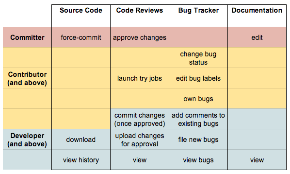

Project Roles
=============

The Skia open source project includes individuals working in a variety of
roles.  Anyone can view the code, use the Skia library, file bugs, and submit
patches.  This page describes in detail the kinds of roles that interested
parties can assume.

For more information on ways to get involved in Skia development, see the
[Contributing to Skia page](/dev/contrib/).

  
