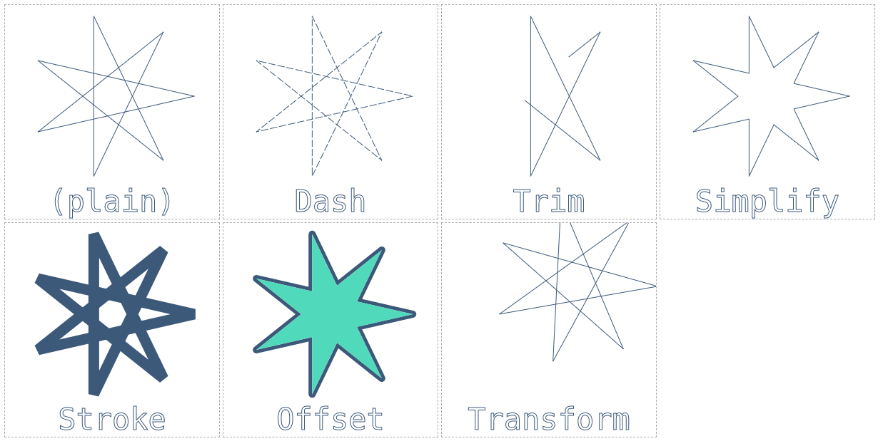

PathKit - Geometry in the Browser
=============================

Skia has made its [SkPath](../api/SkPath_Reference) object and many related methods
available to JS clients (e.g. Web Browsers) using WebAssembly and asm.js.

Features
--------

PathKit is still under rapid development, so the exact API is subject to change.

The primary features are:

  - API compatibility (e.g. drop-in replacement) with [Path2D](https://developer.mozilla.org/en-US/docs/Web/API/Path2D)
  - Can output to SVG / Canvas / Path2D
  - Exposes a variety of path effects:

  <canvas class=patheffect id=canvas1 title="Plain: A drawn star with overlapping solid lines"></canvas>
  <canvas class=patheffect id=canvas2 title="Dash: A drawn star with overlapping dashed lines"></canvas>
  <canvas class=patheffect id=canvas3 title="Trim: A portion of a drawn star with overlapping solid lines"></canvas>
  <canvas class=patheffect id=canvas4 title="Simplify: A drawn star with non-overlapping solid lines."></canvas>
  <canvas class=patheffect id=canvas5 title="Stroke: A drawn star with non-overlapping solid lines stroked at various thicknesses and with square edges"></canvas>
  <canvas class=patheffect id=canvas6 title="Grow: A drawn star's expanding outline"></canvas>
  <canvas class=patheffect id=canvas7 title="Shrink: A solid drawn star shrunk down"></canvas>
  <canvas class=patheffect id=canvasTransform title="Transform: A drawn star moved and rotated by an Affine Matrix"></canvas>

Example Code
------------
The best place to look for examples on how to use PathKit would be in the
[example.html](https://github.com/google/skia/blob/master/modules/pathkit/npm-wasm/example.html#L45),
which comes in the npm package.

Download the library
--------------------

See the the npm page for either the [WebAssembly](https://www.npmjs.com/package/pathkit-wasm) version
or the [asm.js](https://www.npmjs.com/package/pathkit-asmjs) version
for details on downloading and getting started.

WebAssembly has faster load times and better overall performance but is
currently supported by Chrome, Firefox, Edge, and Safari.
The asm.js version should run anywhere JavaScript does.

API
----

The primary feature of the library is the `SkPath` object. It can be created:

 - From the SVG string of a path `PathKit.FromSVGString(str)`
 - From a 2D array of verbs and arguments `PathKit.FromCmds(cmds)`
 - From `PathKit.NewPath()` (It will be blank)
 - As a copy of an existing `SkPath` with `path.copy()` or `PathKit.NewPath(path)`

It can be exported as:

 - An SVG string `path.toSVGString()`
 - A [Path2D](https://developer.mozilla.org/en-US/docs/Web/API/Path2D) object `path.toPath2D()`
 - Directly to a canvas 2D context `path.toCanvas(ctx)`
 - A 2D array of verbs and arguments `path.toCmds()`

Once an SkPath object has been made, it can be interacted with in the following ways:

 - expanded by any of the Path2D operations (`moveTo`, `lineTo`, `rect`, `arc`, etc)
 - combined with other paths using `op` or `PathKit.MakeFromOp(p1, p2, op)`.  For example, `path1.op(path2, PathKit.PathOp.INTERSECT)` will set path1 to be the area represented by where path1 and path2 overlap (intersect). `PathKit.MakeFromOp(path1, path2, PathKit.PathOp.INTERSECT)` will do the same but returned as a new `SkPath` object.
 - adjusted with some of the effects (`trim`, `dash`, `stroke`, etc)

**Important**: Any objects (`SkPath`, `SkOpBuilder`, etc) that are created must be cleaned up with `path.delete()` when they
leave the scope to avoid leaking the memory in the WASM heap. This includes any of the constructors, `copy()`,
or any function prefixed with "make".

### PathKit ###

#### `FromSVGString(str)` ####
**str** - `String` representing an [SVGPath](https://www.w3schools.com/graphics/svg_path.asp)

Returns an `SkPath` with the same verbs and arguments as the SVG string, or `null` on a failure.

Example:

    let path = PathKit.FromSVGString('M150 0 L75 200 L225 200 Z');
    // path represents a triangle
    // don't forget to do path.delete() when it goes out of scope.

#### `FromCmds(cmds)` ####
**cmds** - `Array<Array<Number>>`, a 2D array of commands, where a command is a verb
           followed by its arguments.

Returns an `SkPath` with the verbs and arguments from the list or `null` on a failure.

This can be faster than calling `.moveTo()`, `.lineTo()`, etc many times.

Example:

    let cmds = [
        [PathKit.MOVE_VERB, 0, 10],
        [PathKit.LINE_VERB, 30, 40],
        [PathKit.QUAD_VERB, 20, 50, 45, 60],
    ];
    let path = PathKit.FromCmds(cmds);
    // path is the same as if a user had done
    // let path = PathKit.NewPath().moveTo(0, 10).lineTo(30, 40).quadTo(20, 50, 45, 60);
    // don't forget to do path.delete() when it goes out of scope.

#### `NewPath()` ####

Returns an empty `SkPath` object.

Example:

    let path = PathKit.NewPath();
    path.moveTo(0, 10)
        .lineTo(30, 40)
        .quadTo(20, 50, 45, 60);
    // don't forget to do path.delete() when it goes out of scope.
    // Users can also do let path = new PathKit.SkPath();

#### `NewPath(pathToCopy)` ####
**pathToCopy** - SkPath, a path to make a copy of.

Returns a `SkPath` that is a copy of the passed in `SkPath`.

Example:

    let otherPath = ...;
    let clone = PathKit.NewPath(otherPath);
    clone.simplify();
    // don't forget to do clone.delete() when it goes out of scope.
    // Users can also do let clone = new PathKit.SkPath(otherPath);
    // or let clone = otherPath.copy();

#### `MakeFromOp(pathOne, pathTwo, op)` ####
**pathOne** - `SkPath`, a path.  
**pathTwo** - `SkPath`, a path.  
**op** - `PathOp`, an op to apply

Returns a new `SkPath` that is the result of applying the given PathOp to the first and second
path (order matters).

Example:

    let pathOne = PathKit.NewPath().moveTo(0, 20).lineTo(10, 10).lineTo(20, 20).close();
    let pathTwo = PathKit.NewPath().moveTo(10, 20).lineTo(20, 10).lineTo(30, 20).close();
    let mountains = PathKit.MakeFromOp(pathOne, pathTwo, PathKit.PathOp.UNION);
    // don't forget to do mountains.delete() when it goes out of scope.
    // Users can also do pathOne.op(pathTwo, PathKit.PathOp.UNION);
    // to have the resulting path be stored to pathOne and avoid allocating another object.

#### `cubicYFromX(cpx1, cpy1, cpx2, cpy2, X)` ####
**cpx1, cpy1, cpx2, cpy2** - `Number`, coordinates for control points.  
**X** - `Number`, The X coordinate for which to find the corresponding Y coordinate.

Fast evaluation of a cubic ease-in / ease-out curve. This is defined as a parametric cubic
curve inside the unit square. Makes the following assumptions:

  - pt[0] is implicitly { 0, 0 }
  - pt[3] is implicitly { 1, 1 }
  - pts[1, 2] are inside the unit square

This returns the Y coordinate for the given X coordinate.

#### `cubicPtFromT(cpx1, cpy1, cpx2, cpy2, T)` ####
**cpx1, cpy1, cpx2, cpy2** - `Number`, coordinates for control points.  
**T** - `Number`, The T param for which to find the corresponding (X, Y) coordinates.

Fast evaluation of a cubic ease-in / ease-out curve. This is defined as a parametric cubic
curve inside the unit square. Makes the following assumptions:

  - pt[0] is implicitly { 0, 0 }
  - pt[3] is implicitly { 1, 1 }
  - pts[1, 2] are inside the unit square

This returns the (X, Y) coordinate for the given T value as a length 2 array.

### SkPath (object) ###

#### `addPath(otherPath)` ####
**otherPath** - `SkPath`, a path to append to this path

Adds the given path to `this` and then returns `this` for chaining purposes.

#### `addPath(otherPath, transform)` ####
**otherPath** - `SkPath`, a path to append to this path.  
**transform** - [SVGMatrix](https://developer.mozilla.org/en-US/docs/Web/API/SVGMatrix),
                a transform to apply to otherPath before appending it.

Adds the given path to `this` after applying the transform and then returns `this` for
chaining purposes. See [Path2D.addPath()](https://developer.mozilla.org/en-US/docs/Web/API/Path2D/addPath)
for more details.

#### `addPath(otherPath, a, b, c, d, e, f)` ####
**otherPath** - `SkPath`, a path to append to this path.  
**a, b, c, d, e, f** - `Number`, the six components of an
                       [SVGMatrix](https://developer.mozilla.org/en-US/docs/Web/API/SVGMatrix),
                       which define the transform to apply to otherPath before appending it.

Adds the given path to `this` after applying the transform and then returns `this` for
chaining purposes. See [Path2D.addPath()](https://developer.mozilla.org/en-US/docs/Web/API/Path2D/addPath)
for more details.

Example:

    let box = PathKit.NewPath().rect(0, 0, 100, 100);
    let moreBoxes = PathKit.NewPath();
    // add box un-transformed (i.e. at 0, 0)
    moreBoxes.addPath(box)
    // the params fill out a 2d matrix like:
    //     a c e
    //     b d f
    //     0 0 1
    // add box 300 points to the right
             .addPath(box, 1, 0, 0, 1, 300, 0)
    // add a box shrunk by 50% in both directions
             .addPath(box, 0.5, 0, 0, 0.5, 0, 0);
    // moreBoxes now has 3 paths appended to it

#### `addPath(otherPath, scaleX, skewX, transX, skewY, scaleY, transY, pers0, pers1, pers2)` ####
**otherPath** - `SkPath`, a path to append to this path.  
**scaleX, skewX, transX, skewY, scaleY, transY, pers0, pers1, pers2** -
                       `Number`, the nine components of an
                       [Affine Matrix](https://en.wikipedia.org/wiki/Transformation_matrix#Affine_transformations),
                       which define the transform to apply to otherPath before appending it.

Adds the given path to `this` after applying the transform and then returns `this` for
chaining purposes.

Example:

    let box = PathKit.NewPath().rect(0, 0, 100, 100);
    let moreBoxes = PathKit.NewPath();
    // add box un-transformed (i.e. at 0, 0)
    moreBoxes.addPath(box)
    // add box 300 points to the right
             .addPath(box, 1, 0, 0,
                           0, 1, 300,
                           0, 0 ,1)
    // add a box shrunk by 50% in both directions
             .addPath(box, 0.5, 0,   0,
                           0,   0.5, 0,
                           0,   0,   1)
    // moreBoxes now has 3 paths appended to it

#### `arc(x, y, radius, startAngle, endAngle, ccw=false)` ####
**x, y** - `Number`, The coordinates of the arc's center.  
**radius** - `Number`, The radius of the arc.  
**startAngle, endAngle** - `Number`, the start and end of the angle, measured
                           clockwise from the positive x axis and in radians.  
**ccw** - `Boolean`, optional argument specifying if the arc should be drawn
          counter-clockwise between **startAngle** and **endAngle** instead of
          clockwise, the default.

Adds the described arc to `this` then returns `this` for
chaining purposes.  See [Path2D.arc()](https://developer.mozilla.org/en-US/docs/Web/API/CanvasRenderingContext2D/arc)
for more details.

Example:

    let path = PathKit.NewPath();
    path.moveTo(20, 120);
        .arc(20, 120, 18, 0, 1.75 * Math.PI);
        .lineTo(20, 120);
    // path looks like a pie with a 1/8th slice removed.

#### `arcTo(x1, y1, x2, y2, radius)` ####
**x1, y1, x2, y2** - `Number`, The coordinates defining the control points.  
**radius** - `Number`, The radius of the arc.

Adds the described arc to `this` (appending a line, if needed) then returns `this` for
chaining purposes.  See [Path2D.arcTo()](https://developer.mozilla.org/en-US/docs/Web/API/CanvasRenderingContext2D/arcTo)
for more details.

#### `close()` or `closePath()` ####
Returns the pen to the start of the current sub-path, then returns `this` for
chaining purposes.  See [Path2D.closePath()](https://developer.mozilla.org/en-US/docs/Web/API/CanvasRenderingContext2D/closePath)
for more details.

#### `computeTightBounds()` ####

Returns an `SkRect` that represents the minimum and maximum area of
`this` path. See [SkPath reference](https://skia.org/user/api/SkPath_Reference#SkPath_computeTightBounds)
for more details.

#### `conicTo(x1, y1, x2, y2, w)` ####
**x1, y1, x2, y2** - `Number`, The coordinates defining the control point and the end point.  
**w** - `Number`, The weight of the conic.

Adds the described conic line to `this` (appending a line, if needed) then returns `this` for
chaining purposes. See [SkPath reference](https://skia.org/user/api/SkPath_Reference#SkPath_conicTo)
for more details.

#### `copy()` ####

Return a copy of `this` path.

#### `cubicTo(cp1x, cp1y, cp2x, cp2y, x, y)` or `bezierCurveTo(cp1x, cp1y, cp2x, cp2y, x, y)` ####
**cp1x, cp1y, cp2x, cp2y** - `Number`, The coordinates defining the control points.  
**x,y** - `Number`, The coordinates defining the end point

Adds the described cubic line to `this` (appending a line, if needed) then returns `this` for
chaining purposes. See [Path2D.bezierCurveTo](https://developer.mozilla.org/en-US/docs/Web/API/CanvasRenderingContext2D/bezierCurveTo)
for more details.

#### `dash(on, off, phase)` ####
**on, off** - `Number`, The number of pixels the dash should be on (drawn) and off (blank).  
**phase** - `Number`, The number of pixels the on/off should be offset (mod **on** + **off**)

Applies a dashed path effect to `this` then returns `this` for chaining purposes.
See the "Dash" effect above for a visual example.

Example:

    let box = PathKit.NewPath().rect(0, 0, 100, 100);
    box.dash(20, 10, 3);
    // box is now a dashed rectangle that will draw for 20 pixels, then
    // stop for 10 pixels.  Since phase is 3, the first line won't start
    // at (0, 0), but 3 pixels around the path (3, 0)

#### `ellipse(x, y, radiusX, radiusY, rotation, startAngle, endAngle, ccw=false)` ####
**x, y** - `Number`, The coordinates of the center of the ellipse.  
**radiusX, radiusY** - `Number`, The radii in the X and Y directions.  
**rotation** - `Number`, The rotation in radians of this ellipse.  
**startAngle, endAngle** - `Number`, the starting and ending angles of which to draw,
                            measured in radians from the positive x axis.  
**ccw** - `Boolean`, optional argument specifying if the ellipse should be drawn
          counter-clockwise between **startAngle** and **endAngle** instead of
          clockwise, the default.

Adds the described ellipse to `this` then returns `this` for chaining purposes.
See [Path2D.ellipse](https://developer.mozilla.org/en-US/docs/Web/API/CanvasRenderingContext2D/ellipse)
for more details.

#### `equals(otherPath)` ####
**otherPath** - `SkPath`, the path to compare to.

Returns a `Boolean` value based on if `this` path is equal
to **otherPath**.

#### `getBounds()` ####

Returns an `SkRect` that represents the minimum and maximum area of
`this` path. See [SkPath reference](https://skia.org/user/api/SkPath_Reference#SkPath_getBounds)
for more details.

#### `getFillType()` ####

Returns a `FillType` based on what this path is. This defaults to
`PathKit.FillType.WINDING`, but may change with `op()` or `simplify()`.

Clients will typically want `getFillTypeString()` because that value
can be passed directly to an SVG or Canvas.

#### `getFillTypeString()` ####

Returns a `String` representing the fillType of `this` path.
The values are either "nonzero" or "evenodd".

Example:

    let path = ...;
    let ctx = document.getElementById('canvas1').getContext('2d');
    ctx.strokeStyle = 'green';
    ctx.fill(path.toPath2D(), path.getFillTypeString());

#### `moveTo(x, y)` ####
**x, y** - `Number`, The coordinates of where the pen should be moved to.

Moves the pen (without drawing) to the given coordinates then returns `this` for chaining purposes.
See [Path2D.moveTo](https://developer.mozilla.org/en-US/docs/Web/API/CanvasRenderingContext2D/moveTo)
for more details.

#### `lineTo(x, y)` ####
**x, y** - `Number`, The coordinates of where the pen should be moved to.

Draws a straight line to the given coordinates then returns `this` for chaining purposes.
See [Path2D.lineTo](https://developer.mozilla.org/en-US/docs/Web/API/CanvasRenderingContext2D/lineTo)
for more details.

#### `op(otherPath, operation)` ####
**otherPath** - `SkPath`, The other path to be combined with `this`.  
**operation** - `PathOp`, The operation to apply to the two paths.

Combines otherPath into `this` path with the given operation and returns `this`
for chaining purposes.

Example:

    let pathOne = PathKit.NewPath().moveTo(0, 20).lineTo(10, 10).lineTo(20, 20).close();
    let pathTwo = PathKit.NewPath().moveTo(10, 20).lineTo(20, 10).lineTo(30, 20).close();
    // Combine the two triangles to look like two mountains
    let mountains = pathOne.copy().op(pathOne, pathTwo, PathKit.PathOp.UNION);
    // set pathOne to be the small triangle where pathOne and pathTwo overlap
    pathOne.op(pathOne, pathTwo, PathKit.PathOp.INTERSECT);
    // since copy() was called, don't forget to call delete() on mountains.

#### `quadTo(cpx, cpy, x, y)` or `quadraticCurveTo(cpx, cpy, x, y)` ####
**cpx, cpy** - `Number`, The coordinates for the control point.  
**x, y** - `Number`, The coordinates for the end point.

Draws a quadratic Bézier curve with the given coordinates then returns `this` for chaining purposes.
See [Path2D.quadraticCurveTo](https://developer.mozilla.org/en-US/docs/Web/API/CanvasRenderingContext2D/quadraticCurveTo)
for more details.

#### `rect(x, y, w, h)` ####
**x, y** - `Number`, The coordinates of the upper-left corner of the rectangle.  
**w, h** - `Number`, The width and height of the rectangle

Draws a rectangle on `this`, then returns `this` for chaining purposes.
See [Path2D.rect](https://developer.mozilla.org/en-US/docs/Web/API/CanvasRenderingContext2D/rect)
for more details.

#### `setFillType(fillType)` ####
**fillType** - `FillType`, the new fillType.

Set the fillType of the path. See [SkPath reference](https://skia.org/user/api/SkPath_Reference#SkPath_FillType)
for more details.

#### `simplify()` ####
Set `this` path to a set of *non-overlapping* contours that describe the same area
as the original path. See the "Simplify" effect above for a visual example.

#### `stroke(opts)` ####
**opts** - `StrokeOpts`, contains the options for stroking.

Strokes `this` path out with the given options. This can be used for a variety of
effects.  See the "Stroke", "Grow", and "Shrink" effects above for visual examples.

Example:

    let box = PathKit.NewPath().rect(0, 0, 100, 100);
    // Stroke the path with width 10 and rounded corners
    let rounded = box.copy().stroke({width: 10, join: PathKit.StrokeJoin.ROUND});
    // Grow effect, that is, a 20 pixel expansion around the box.
    let grow = box.copy().stroke({width: 20}).op(box, PathKit.PathOp.DIFFERENCE);
    // Shrink effect, in which we subtract away from the original
    let simplified = box.copy().simplify(); // sometimes required for complicated paths
    let shrink = box.copy().stroke({width: 15, cap: PathKit.StrokeCap.BUTT})
                           .op(simplified, PathKit.PathOp.REVERSE_DIFFERENCE);
    // Don't forget to call delete() on each of the copies!

#### `toCanvas(ctx)` ####
**ctx** - `Canvas2DContext`, Canvas on which to draw the path.

Draws `this` path on the passed in
[Canvas Context](https://developer.mozilla.org/en-US/docs/Web/API/CanvasRenderingContext2D).

Example:

    let box = PathKit.NewPath().rect(0, 0, 100, 100);
    let ctx = document.getElementById('canvas1').getContext('2d');
    ctx.strokeStyle = 'green';
    ctx.beginPath();
    box.toCanvas(ctx);
    ctx.stroke();  // could also ctx.fill()

#### `toCmds()` ####

Returns a 2D Array of verbs and args. See `PathKit.FromCmds()` for
more details.

#### `toPath2D()` ####

Returns a [Path2D](https://developer.mozilla.org/en-US/docs/Web/API/Path2D) object
that has the same operations as `this` path.

Example:

    let box = PathKit.NewPath().rect(0, 0, 100, 100);
    let ctx = document.getElementById('canvas1').getContext('2d');
    ctx.strokeStyle = 'green';
    ctx.stroke(box.toPath2D());

#### `toSVGString()` ####

Returns a `String` representing an [SVGPath](https://www.w3schools.com/graphics/svg_path.asp) based on `this` path.

Example:

    let box = PathKit.NewPath().rect(0, 0, 100, 100);
    let svg = document.getElementById('svg1');
    let newPath = document.createElementNS('http://www.w3.org/2000/svg', 'path');
    newPath.setAttribute('stroke', 'green');
    newPath.setAttribute('fill', 'white');
    newPath.setAttribute('d', box.toSVGString());
    svg.appendChild(newPath);

#### `transform(matr)` ####
**matr** - `SkMatrix`, i.e. an `Array<Number>` of the nine numbers of an Affine Transform Matrix.

Applies the specified [transform](https://en.wikipedia.org/wiki/Transformation_matrix#Affine_transformations)
to `this` and then returns `this` for chaining purposes.

#### `transform(scaleX, skewX, transX, skewY, scaleY, transY, pers0, pers1, pers2)` ####
**scaleX, skewX, transX, skewY, scaleY, transY, pers0, pers1, pers2** -
        `Number`, the nine numbers of an Affine Transform Matrix.

Applies the specified [transform](https://en.wikipedia.org/wiki/Transformation_matrix#Affine_transformations)
to `this` and then returns `this` for chaining purposes.

Example:

    let path = PathKit.NewPath().rect(0, 0, 100, 100);
    // scale up the path by 5x
    path.transform([5, 0, 0,
                    0, 5, 0,
                    0, 0, 1]);
    // move the path 75 px to the right.
    path.transform(1, 0, 75,
                   0, 1, 0,
                   0, 0, 1);

#### `trim(startT, stopT, isComplement=false)` ####
**startT, stopT** - `Number`, values in [0, 1] that indicate the start and stop
                    "percentages" of the path to draw  
**isComplement** - `Boolean`, If the complement of the trimmed section should
                    be drawn instead of the areas between **startT** and **stopT**.

Sets `this` path to be a subset of the original path, then returns `this` for chaining purposes.
See the "Trim" effect above for a visual example.

Example:

    let box = PathKit.NewPath().rect(0, 0, 100, 100);
    box.trim(0.25, 1.0);
    // box is now the 3 segments that look like a U
    // (the top segment has been removed).

### SkOpBuilder (object)  ###
This object enables chaining multiple PathOps together.
Create one with `let builder = new PathKit.SkOpBuilder();`
When created, the internal state is "empty path".
Don't forget to call `delete()` on both the builder and the result
of `resolve()`

#### `add(path, operation)` ####
**path** - `SkPath`, The path to be combined with the given rule.  
**operation** - `PathOp`, The operation to apply to the two paths.

Adds a path and the operand to the builder.

#### `make()` or `resolve()` ####

Creates and returns a new `SkPath` based on all the given paths
and operands.

Don't forget to call `.delete()` on the returned path when it goes out of scope.

### SkMatrix (struct) ###
`SkMatrix` translates between a C++ struct and a JS Array.
It basically takes a nine element 1D Array and turns it into a
3x3 2D Affine Matrix.

### SkRect (struct) ###

`SkRect` translates between a C++ struct and a JS Object with
the following keys (all values are `Number`:

  - **fLeft**: x coordinate of top-left corner
  - **fTop**: y coordinate of top-left corner
  - **fRight**: x coordinate of bottom-right corner
  - **fBottom**: y coordinate of bottom-rightcorner

### StrokeOpts (struct) ###
`StrokeOpts` translates between a C++ struct and a JS Object with
the following keys:

  - **width**, `Number` the width of the lines of the path. Default 1.
  - **miter_limit**, `Number`, the miter limit. Defautl 4. See [SkPaint reference](https://skia.org/user/api/SkPaint_Reference#Miter_Limit) for more details.
  - **join**, `StrokeJoin`, the join to use. Default `PathKit.StrokeJoin.MITER`.
See [SkPaint reference](https://skia.org/user/api/SkPaint_Reference#SkPaint_Join) for more details.
  - **cap**, `StrokeCap`, the cap to use. Default `PathKit.StrokeCap.BUTT`.
See [SkPaint reference](https://skia.org/user/api/SkPaint_Reference#Stroke_Cap) for more details.

### PathOp (enum) ###
The following enum values are exposed. They are essentially constant
objects, differentiated by thier `.value` property.

  - `PathKit.PathOp.DIFFERENCE`
  - `PathKit.PathOp.INTERSECT`
  - `PathKit.PathOp.REVERSE_DIFFERENCE`
  - `PathKit.PathOp.UNION`
  - `PathKit.PathOp.XOR`

These are used in `PathKit.MakeFromOp()` and `SkPath.op()`.

### FillType (enum) ###
The following enum values are exposed. They are essentially constant
objects, differentiated by thier `.value` property.

  - `PathKit.FillType.WINDING` (also known as nonzero)
  - `PathKit.FillType.EVENODD`
  - `PathKit.FillType.INVERSE_WINDING`
  - `PathKit.FillType.INVERSE_EVENODD`

These are used by `SkPath.getFillType()` and `SkPath.setFillType()`, but
generally clients will want `SkPath.getFillTypeString()`.

### StrokeJoin (enum) ###
The following enum values are exposed. They are essentially constant
objects, differentiated by thier `.value` property.

  - `PathKit.StrokeJoin.MITER`
  - `PathKit.StrokeJoin.ROUND`
  - `PathKit.StrokeJoin.BEVEL`

See [SkPaint reference](https://skia.org/user/api/SkPaint_Reference#SkPaint_Join) for more details.

### StrokeCap (enum) ###
The following enum values are exposed. They are essentially constant
objects, differentiated by thier `.value` property.

  - `PathKit.StrokeCap.BUTT`
  - `PathKit.StrokeCap.ROUND`
  - `PathKit.StrokeCap.SQUARE`

See [SkPaint reference](https://skia.org/user/api/SkPaint_Reference#Stroke_Cap) for more details.

### Constants ###
The following constants are exposed:

  - `PathKit.MOVE_VERB` = 0
  - `PathKit.LINE_VERB` = 1
  - `PathKit.QUAD_VERB` = 2
  - `PathKit.CONIC_VERB` = 3
  - `PathKit.CUBIC_VERB` = 4
  - `PathKit.CLOSE_VERB` = 5

These are only needed for `PathKit.FromCmds()`.

### Functions for testing only ###

#### `PathKit.LTRBRect(left, top, right, bottom)` ####
**left** - `Number`, x coordinate of top-left corner of the `SkRect`.  
**top** - `Number`, y coordinate of top-left corner of the `SkRect`.  
**right** - `Number`, x coordinate of bottom-right corner of the `SkRect`.  
**bottom** - `Number`, y coordinate of bottom-right corner of the `SkRect`.

Returns an `SkRect` object with the given params.

#### `SkPath.dump()` ####

Prints all the verbs and arguments to the console.
Only available on Debug and Test builds.
