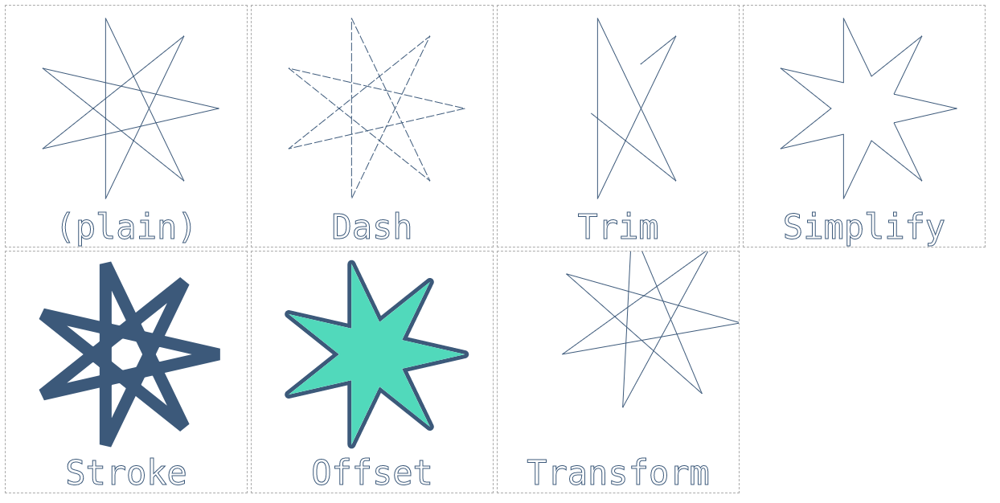

PathKit - Skia in the Browser
=============================

Skia has made its [SkPath](../api/SkPath_Reference) object and many related methods
available to JS clients (e.g. Web Browsers) using WebAssembly and asm.js.

Download the library
--------------------

See the the npm page for either the [WebAssembly](https://www.npmjs.com/package/experimental-pathkit-wasm)
or [asm.js](https://www.npmjs.com/package/experimental-pathkit-asmjs) version
for details on downloading and getting started.

Features
--------

PathKit is still under rapid development, so the exact API is still changing.

The primary features are:

  - API compatibility (e.g. drop-in replacement) with [Path2D](https://developer.mozilla.org/en-US/docs/Web/API/Path2D)
  - Can output to SVG / Canvas / Path2D
  - Exposes a variety of path effects:

  <canvas class=patheffect id=canvas1></canvas>
  <canvas class=patheffect id=canvas2></canvas>
  <canvas class=patheffect id=canvas3></canvas>
  <canvas class=patheffect id=canvas4></canvas>
  <canvas class=patheffect id=canvas5></canvas>
  <canvas class=patheffect id=canvas6></canvas>
  <canvas class=patheffect id=canvas7></canvas>
  <canvas class=patheffect id=canvasTransform></canvas>

Example Code
------------
The best place to look for examples on how to use PathKit would be in the
[example.html](https://github.com/google/skia/blob/master/experimental/pathkit/npm-wasm/example.html#L45)
which comes in the npm package.

API
----

The primary feature of the library is the `SkPath` object. It can be created:

 - From the SVG string of a path `PathKit.FromSVGString(str)`
 - From a 2D array of verbs and arguments `PathKit.FromCmds(cmds)`
 - From `PathKit.NewPath()` (It will be blank)
 - As a copy of an existing `SkPath` with `path.copy()` or `PathKit.NewPath(path)`

It can be exported as:

 - An SVG string `path.toSVGString()`
 - A [Path2D](https://developer.mozilla.org/en-US/docs/Web/API/Path2D) object `path.toPath2D()`
 - Directly to a canvas 2D context `path.toCanvas(ctx)`
 - A 2D array of verbs and arguments `path.toCmds()`

Once an SkPath object has been made, it can be interacted with in the following ways:

 - expanded by any of the Path2D operations (`moveTo`, `lineTo`, `rect`, `arc`, etc)
 - combined with other paths using `op` or `PathKit.MakeFromOp(p1, p2, op)`.  For example, `path1.op(path2, PathKit.PathOp.INTERSECT)` will set path1 to be the area represented by where path1 and path2 overlap (intersect). `PathKit.MakeFromOp(path1, path2, PathKit.PathOp.INTERSECT)` will do the same but returned as a new `SkPath` object.
 - adjusted with some of the effects (`trim`, `dash`, `stroke`, etc)

**Important**: Any objects (`SkPath`, `SkOpBuilder`, etc) that are created must be cleaned up with `path.delete()` when they
leave the scope to avoid leaking the memory in the WASM heap. This counts any of the constructors or
any function prefixed with "Make".

### PathKit ###

#### `FromSVGString(str)` ####
**str** - `String` representing an [SVGPath](https://www.w3schools.com/graphics/svg_path.asp)

Returns an `SkPath` with the same verbs and arguments as the SVG string, or `null` on a failure.

Example:

    let path = PathKit.FromSVGString('M150 0 L75 200 L225 200 Z');
    // path represents a triangle
    // don't forget to do path.delete() when it goes out of scope.

#### `FromCmds(cmds)` ####
**cmds** - `Array<Array<Number>>`, a 2D array of commands, where a command is a verb
           followed by its arguments.

Returns an `SkPath` with the verbs and arguments from the list or `null` on a failure.

This can be faster than calling `.moveTo()`, `.lineTo()`, etc many times.

Example:

    let cmds = [
        [PathKit.MOVE_VERB, 0, 10],
        [PathKit.LINE_VERB, 30, 40],
        [PathKit.QUAD_VERB, 20, 50, 45, 60],
    ];
    let path = PathKit.FromCmds(cmds);
    // path is the same as if a user had done
    // let path = PathKit.NewPath().moveTo(0, 10).lineTo(30, 40).quadTo(20, 50, 45, 60);
    // don't forget to do path.delete() when it goes out of scope.

#### `NewPath()` ####

Returns an empty `SkPath` object.

Example:

    let path = PathKit.NewPath();
    path.moveTo(0, 10)
        .lineTo(30, 40)
        .quadTo(20, 50, 45, 60);
    // don't forget to do path.delete() when it goes out of scope.
    // Users can also do let path = new PathKit.SkPath();

#### `NewPath(pathToCopy)` ####
**pathToCopy** - SkPath, a path to make a copy of.

Returns a `SkPath` that is a copy of the passed in `SkPath`.

Example:

    let otherPath = ...;
    let clone = PathKit.NewPath(otherPath);
    clone.simplify();
    // don't forget to do clone.delete() when it goes out of scope.
    // Users can also do let clone = new PathKit.SkPath(otherPath);
    // or let clone = otherPath.copy();

#### `MakeFromOp(pathOne, pathTwo, op)` ####
**pathOne** - `SkPath`, a path.  
**pathTwo** - `SkPath`, a path.  
**op** - `PathOp`, an op to apply

Returns a new `SkPath` that is the result of applying the given PathOp to the first and second
path (order matters).

Example:

    let pathOne = PathKit.NewPath().moveTo(0, 20).lineTo(10, 10).lineTo(20, 20).close();
    let pathTwo = PathKit.NewPath().moveTo(10, 20).lineTo(20, 10).lineTo(30, 20).close();
    let mountains = PathKit.MakeFromOp(pathOne, pathTwo, PathKit.PathOp.UNION);
    // don't forget to do mountains.delete() when it goes out of scope.
    // Users can also do pathOne.op(pathTwo, PathKit.PathOp.UNION);
    // to have the resulting path be stored to pathOne and avoid allocating another object.

### SkPath (object) ###

#### `addPath(otherPath)` ####
**otherPath** - `SkPath`, a path to append to this path

Adds the given path to `this` and then returns `this` for chaining purposes.

#### `addPath(otherPath, transform)` ####
**otherPath** - `SkPath`, a path to append to this path.  
**transform** - [SVGMatrix](https://developer.mozilla.org/en-US/docs/Web/API/SVGMatrix),
                a transform to apply to otherPath before appending it.

Adds the given path to `this` after applying the transform and then returns `this` for
chaining purposes. See [Path2D.addPath()](https://developer.mozilla.org/en-US/docs/Web/API/Path2D/addPath)
for more details.

#### `addPath(otherPath, a, b, c, d, e, f)` ####
**otherPath** - `SkPath`, a path to append to this path.  
**a, b, c, d, e, f** - `Number`, the 6 components of an
                       [SVGMatrix](https://developer.mozilla.org/en-US/docs/Web/API/SVGMatrix),
                       which define the transform to apply to otherPath before appending it.

Adds the given path to `this` after applying the transform and then returns `this` for
chaining purposes. See [Path2D.addPath()](https://developer.mozilla.org/en-US/docs/Web/API/Path2D/addPath)
for more details.

Example:

    let box = PathKit.NewPath().rect(0, 0, 100, 100);
    let moreBoxes = PathKit.NewPath();
    // add box un-transformed (i.e. at 0, 0)
    moreBoxes.addPath(box)
    // the params fill out a 2d matrix like:
    //     a c e
    //     b d f
    //     0 0 1
    // add box 300 points to the right
             .addPath(box, 1, 0, 0, 1, 300, 0)
    // add a box shrunk by 50% in both directions
             .addPath(box, 0.5, 0, 0, 0.5, 0, 0);
    // moreBoxes now has 3 paths appended to it

#### `addPath(otherPath, scaleX, skewX, transX, skewY, scaleY, transY, pers0, pers1, pers2)` ####
**otherPath** - `SkPath`, a path to append to this path.  
**scaleX, skewX, transX, skewY, scaleY, transY, pers0, pers1, pers2** -
                       `Number`, the 9 components of an
                       [Affine Matrix](https://en.wikipedia.org/wiki/Transformation_matrix#Affine_transformations),
                       which define the transform to apply to otherPath before appending it.

Adds the given path to `this` after applying the transform and then returns `this` for
chaining purposes.

Example:

    let box = PathKit.NewPath().rect(0, 0, 100, 100);
    let moreBoxes = PathKit.NewPath();
    // add box un-transformed (i.e. at 0, 0)
    moreBoxes.addPath(box)
    // add box 300 points to the right
             .addPath(box, 1, 0, 0,
                           0, 1, 300,
                           0, 0 ,1)
    // add a box shrunk by 50% in both directions
             .addPath(box, 0.5, 0,   0,
                           0,   0.5, 0,
                           0,   0,   1)
    // moreBoxes now has 3 paths appended to it

#### `arc(x, y, radius, startAngle, endAngle, ccw=false)` ####
**x, y** - `Number`, The coordinates of the arc's center.  
**radius** - `Number`, The radius of the arc.  
**startAngle, endAngle** - `Number`, the start and end of the angle, measured
                           clockwise from the positive x axis and in radians.  
**ccw** - `Boolean`, optional argument specifying if the arc should be drawn
          counter-clockwise between **startAngle** and **endAngle** instead of
          clockwise, the default.

Adds the described arc to `this` then returns `this` for
chaining purposes.  See [Path2D.arc()](https://developer.mozilla.org/en-US/docs/Web/API/CanvasRenderingContext2D/arc)
for more details.

Example:

    let path = PathKit.NewPath();
    path.moveTo(20, 120);
        .arc(20, 120, 18, 0, 1.75 * Math.PI);
        .lineTo(20, 120);
    // path looks like a pie with a 1/8th slice removed.

#### `arcTo(x1, y1, x2, y2, radius)` ####
**x1, y1, x2, y2** - `Number`, The coordinates defining the control points.  
**radius** - `Number`, The radius of the arc.

Adds the described arc to `this` (appending a line, if needed) then returns `this` for
chaining purposes.  See [Path2D.arcTo()](https://developer.mozilla.org/en-US/docs/Web/API/CanvasRenderingContext2D/arcTo)
for more details.

#### `close()` or `closePath()` ####
Returns the pen to the start of the current sub-path, then returns `this` for
chaining purposes.  See [Path2D.closePath()](https://developer.mozilla.org/en-US/docs/Web/API/CanvasRenderingContext2D/closePath)
for more details.

#### `conicTo(x1, y1, x2, y2, w)` ####
**x1, y1, x2, y2** - `Number`, The coordinates defining the control point and the end point.  
**w** - `Number`, The weight of the conic.

Adds the described conic line to `this` (appending a line, if needed) then returns `this` for
chaining purposes. See [SkPath reference](https://skia.org/user/api/SkPath_Reference#SkPath_conicTo)
for more details.

#### `cubicTo(cp1x, cp1y, cp2x, cp2y, x, y)` or `bezierCurveTo(cp1x, cp1y, cp2x, cp2y, x, y)` ####
**cp1x, cp1y, cp2x, cp2y** - `Number`, The coordinates defining the control points.  
**x,y** - `Number`, The coordinates defining the end point

Adds the described cubic line to `this` (appending a line, if needed) then returns `this` for
chaining purposes. See [Path2D.bezierCurveTo](https://developer.mozilla.org/en-US/docs/Web/API/CanvasRenderingContext2D/bezierCurveTo)
for more details.

#### `dash(on, off, phase)` ####
**on, off** - `Number`, The number of pixels the dash should be on (drawn) and off (blank).  
**phase** - `Number`, The number of pixels the on/off should be offset (mod **on** + **off**)

Applies a dashed path effect to `this` then returns `this` for chaining purposes.

Example:

    let box = PathKit.NewPath().rect(0, 0, 100, 100);
    box.dash(20, 10, 3);
    // box is now a dashed rectangle that will draw for 20 pixels, then
    // stop for 10 pixels.  Since phase is 3, the first line won't start
    // at (0, 0), but 3 pixels around the path (3, 0)

#### `ellipse(x, y, radiusX, radiusY, rotation, startAngle, endAngle, ccw=false)` ####
**x, y** - `Number`, The coordinates of the center of the ellipse.  
**radiusX, radiusY** - `Number`, The radii in the X and Y directions.  
**rotation** - `Number`, The rotation in radians of this ellipse.  
**startAngle, endAngle** - `Number`, the starting and ending angles of which to draw,
                            measured in radians from the positive x axis.  
**ccw** - `Boolean`, optional argument specifying if the ellipse should be drawn
          counter-clockwise between **startAngle** and **endAngle** instead of
          clockwise, the default.

Adds the described ellipse to `this` then returns `this` for chaining purposes.
See [Path2D.ellipse](https://developer.mozilla.org/en-US/docs/Web/API/CanvasRenderingContext2D/ellipse)
for more details.

#### `moveTo(x, y)` ####
**x, y** - `Number`, The coordinates of where the pen should be moved to.

Moves the pen (without drawing) to the given coordinates then returns `this` for chaining purposes.
See [Path2D.moveTo](https://developer.mozilla.org/en-US/docs/Web/API/CanvasRenderingContext2D/moveTo)
for more details.

#### `lineTo(x, y)` ####
**x, y** - `Number`, The coordinates of where the pen should be moved to.

Draws a straight line to the given coordinates then returns `this` for chaining purposes.
See [Path2D.lineTo](https://developer.mozilla.org/en-US/docs/Web/API/CanvasRenderingContext2D/lineTo)
for more details.

#### `op(otherPath, operation)` ####
**otherPath** - `SkPath`, The other path to be combined with `this`.  
**operation** - `PathOp`, The operation to apply to the two paths.

Combines otherPath into `this` path with the given operation and returns `this`
for chaining purposes.

Example:

    let pathOne = PathKit.NewPath().moveTo(0, 20).lineTo(10, 10).lineTo(20, 20).close();
    let pathTwo = PathKit.NewPath().moveTo(10, 20).lineTo(20, 10).lineTo(30, 20).close();
    // Combine the two triangles to look like two mountains
    let mountains = pathOne.copy().op(pathOne, pathTwo, PathKit.PathOp.UNION);
    // set pathOne to be the small triangle where pathOne and pathTwo overlap
    pathOne.op(pathOne, pathTwo, PathKit.PathOp.INTERSECT);
    // since copy() was called, don't forget to call delete() on mountains.

#### `quadTo(cpx, cpy, x, y)` or `quadraticCurveTo(cpx, cpy, x, y)` ####
**cpx, cpy** - `Number`, The coordinates for the control point.  
**x, y** - `Number`, The coordinates for the end point.

Draws a quadratic Bézier curve with the given coordinates then returns `this` for chaining purposes.
See [Path2D.quadraticCurveTo](https://developer.mozilla.org/en-US/docs/Web/API/CanvasRenderingContext2D/quadraticCurveTo)
for more details.

#### `rect(x, y, w, h)` ####
**x, y** - `Number`, The coordinates of the upper-left corner of the rectangle.  
**w, h** - `Number`, The width and height of the rectangle

Draws a rectangle on `this`, then returns `this` for chaining purposes.
See [Path2D.rect](https://developer.mozilla.org/en-US/docs/Web/API/CanvasRenderingContext2D/rect)
for more details.

### SkOpBuilder (object)  ###

### SkRect (struct) ###

### SkMatrix (struct) ###

### StrokeOpts (struct) ###

### PathOp (enum) ###

### FillType (enum) ###

### StrokeJoin (enum) ###

### StrokeCap (enum) ###

### Constants ###

### Functions for testing only ###

#### `PathKit.LTRBRect(left, top, right, bottom)` ####
**left** - `Number`, x coordinate of top-left corner of rectangle.  
**top** - `Number`, y coordinate of top-left corner of rectangle.  
**right** - `Number`, x coordinate of bottom-right corner of rectangle.  
**bottom** - `Number`, y coordinate of bottom-rightcorner of rectangle.

Returns an `SkRect` object with the given params.