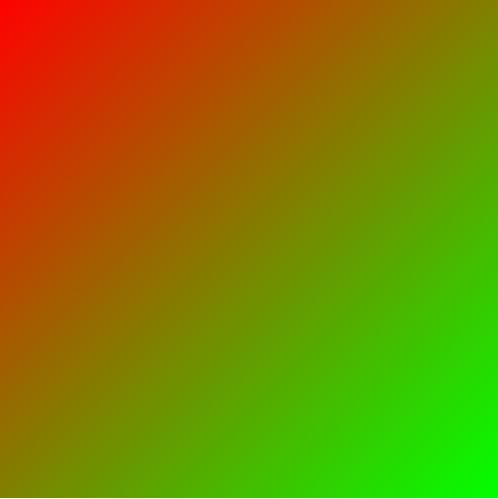
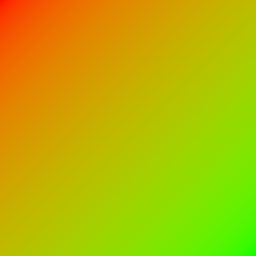
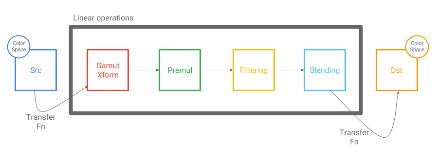

Color Correct Skia
==================

Why is Skia Color Correct?
--------------------------

A color space is a **gamut** and a **transfer function**.

Gamut refers to the **available range of colors** of a particular in an image or on a display
device.  Being gamut correct means that we will display colors as the designer intended and
consistently across display devices.  A common problem with new “wide gamut” devices and
uncorrected colors is illustrated below.

Device Dependent Color (Wrong)

Gamut Corrected Color

Transfer function refers to **a non-linear encoding of pixel values**.  A common transfer function
is shown below.

If we ignore the transfer function and treat non-linear values as if they are linear (when
filtering, blending, anti-aliasing, multiplying), everything gets “too dark”.

For example, we should see yellow (not brown) as the average of red and green light.

Ignore Transfer Function

Apply Transfer Function

Also, we should maintain fine detail when anti-aliasing (or downscaling).

Ignore Transfer Function

Apply Transfer Function

Skia Architecture for Color Correctness
---------------------------------------

The major stages of the Skia drawing pipeline (premultiplication, filtering, blending) all assume
linear inputs and linear outputs.  Also, because they are linear operations, they are
interchangeable.

The gamut transform is a new operation (3x3 matrix) in the pipeline, but with similar properties:
it is a linear operation with linear inputs and linear outputs.

The important shift in logic from the legacy pipeline is that we actually apply the transfer
function to transform the pixels to linear values before performing the linear operations.

The most common transfer function, sRGB, is actually free on GPU!  GPU hardware can transform sRGB
to linear on reads and linear to sRGB on writes.

Best Practices for Color Correct Skia
-------------------------------------

In order to perform color correct rendering, Skia needs to know the **SkColorSpace** of the content
that you draw and the **SkColorSpace** of the surface that you draw to.  There are useful factories
to make color spaces.

<!--?prettify lang=cc?-->

	// Really common color spaces
	sk_sp<SkColorSpace> MakeSRGB();
	sk_sp<SkColorSpace> MakeSRGBLinear();
	
	// Choose a common gamut and a common transfer function
	sk_sp<SkColorSpace> MakeRGB(RenderTargetGamma, Gamut);
	
	// Create a color space from an ICC profile
	sk_sp<SkColorSpace> MakeICC();

Starting with **sources** (the things that draw you draw), there are a number of ways to make sure
that they are tagged with a color space.

**SkColor** (stored on **SkPaint**) is assumed to be in the sRGB color space - meaning that it
is in the sRGB gamut and encoded with the sRGB transfer function.

**SkShaders** (also stored on **SkPaint**) can be used to create more complex colors.  Color and
gradient shaders typically accept **SkColor4f** (float colors).  These high precision colors
can be in any gamut, but must have a linear transfer function.

<!--?prettify lang=cc?-->

	// Create a high precision color in a particular color space
	sk_sp<SkShader> MakeColorShader(const SkColor4f&, sk_sp<SkColorSpace>);
	
	// Create a gradient shader in a particular color space
	sk_sp<SkShader> MakeLinear(const SkPoint pts[2], const SkColor4f colors[2],
	                           sk_sp<SkColorSpace>, ...);
	
	// Many more variations of shaders...
	// Remember that SkColor is always assumed to be sRGB as a convenience

**SkImage** is the preferred representation for image sources.  It is easy to create **SkImages**
 that are tagged with color spaces.

<!--?prettify lang=cc?-->
	
	// Create an image from encoded data (jpeg, png, etc.)
	// Will be tagged with the color space of the encoded data
	sk_sp<SkImage> MakeFromEncoded(sk_sp<SkData> encoded);
	
	// Create an image from a texture in a particular color space
	// Caution: There are versions of this constructor that do not take an
	//          SkColorSpace.  But without an SkColorSpace, Skia does not have
	//          enough information to draw correctly.
	sk_sp<SkImage> MakeFromTexture(GrContext*, const GrBackendTextureDesc&,
	                               SkAlphaType, sk_sp<SkColorSpace>, ...);

**SkBitmap** is another (not preferred) representation for image sources.  Be careful to not forget
the color space.

<!--?prettify lang=cc?-->

	SkBitmap bitmap;
	bitmap.allocN32Pixels(); // Bad: What is the color space?
	
	SkBitmap bitmap;
	SkImageInfo info = SkImageInfo::MakeN32Premul(width, height);
	bitmap.allocPixels(info); // Bad: N32 is shorthand for 8888, no color space
	
	SkBitmap bitmap;
	SkImageInfo info = SkImageInfo::MakeS32(width, height, kPremul_SkAlphaType);
	bitmap.allocPixels(info); // Good: S32 is shorthand for 8888, sRGB

**SkImageInfo** is a useful struct for providing information about pixel buffers.  Remember to use
the color correct variants.

<!--?prettify lang=cc?-->

	// sRGB, 8888
	SkImageInfo MakeS32(int width, int height, SkAlphaType);
	
	// Create an SkImageInfo in a particular color space
	SkImageInfo Make(int width, int height, SkColorType, SkAlphaType,
	                 sk_sp<SkColorSpace>);

Moving to **destinations** (the surfaces that you draw to), there are also constructors that allow
them to be tagged with color spaces.

<!--?prettify lang=cc?-->

	// Raster backed: Make sure |info| has a non-null color space
	sk_sp<SkSurface> MakeRaster(const SkImageInfo& info);
	
	// Gpu backed: Make sure |info| has a non-null color space
	sk_sp<SkSurface> SkSurface::MakeRenderTarget(GrContext, SkBudgeted,
	                                             const SkImageInfo& info);

Opting In To Color Correct Skia
-------------------------------

By itself, **adding a color space tag to a source will not change draw behavior**.  In fact,
tagging sources with color spaces is always a best practice, regardless of whether we want Skia’s
color correct behavior.

Adding a color space tag to the **destination is the trigger that turns on Skia color correct
behavior**.

Drawing a source without a color space to a destination with a color space is undefined.  Skia
cannot know how to draw without knowing the color space of the source.

<table id="colortable">
<tr><th>Source SkColorSpace</th> <th>Destination SkColorSpace</th>  <th>Behavior</th></tr>
<tr><td>Non-null</td>            <td>Non-null</td>                  <td>Color Correct Skia</td></tr>
<tr><td>Null</td>                <td>Non-null</td>                  <td>Undefined</td></tr>
<tr><td>Non-null</td>            <td>Null</td>                      <td>Legacy Skia</td></tr>
<tr><td>Null</td>                <td>Null</td>                      <td>Legacy Skia</td></tr>
</table>

It is possible to create **an object that is both a source and destination**, if Skia will both
draw into it and then draw it somewhere else.  The same rules from above still apply, but it is
subtle that the color space tag could have an effect (or no effect) depending on how the object is
used.