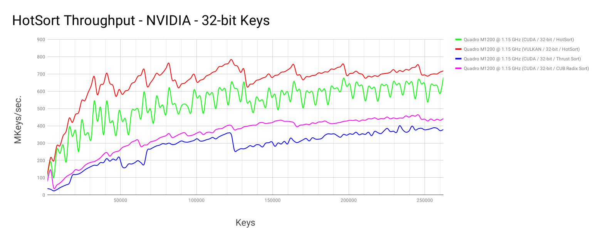
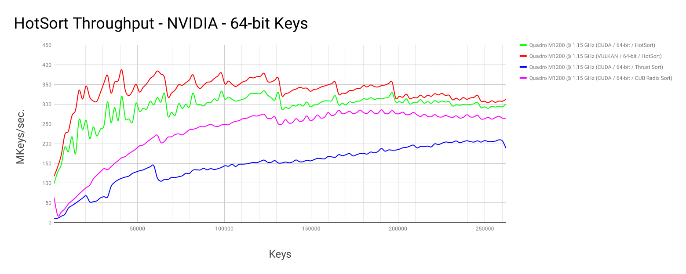
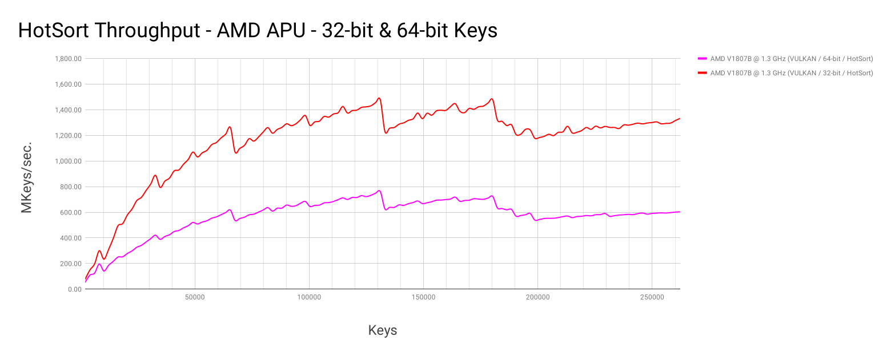
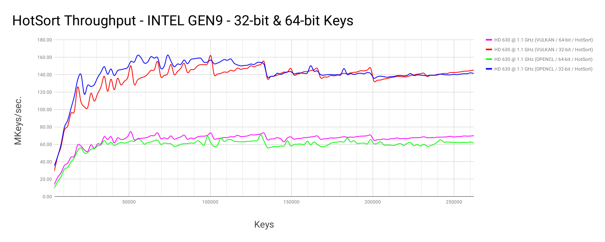
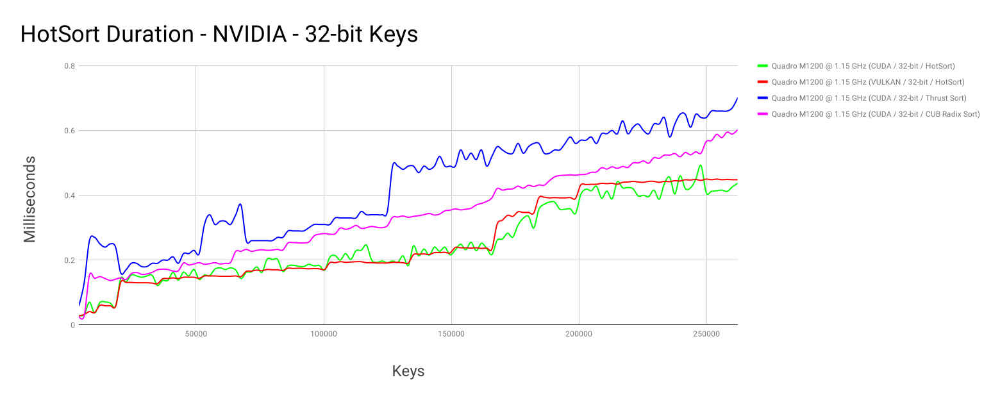
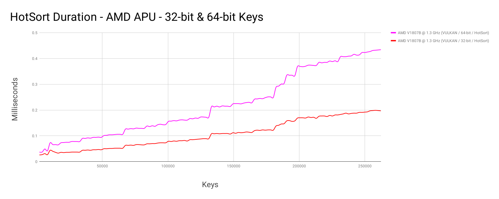
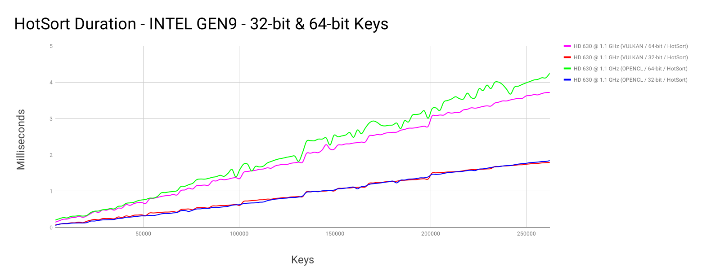
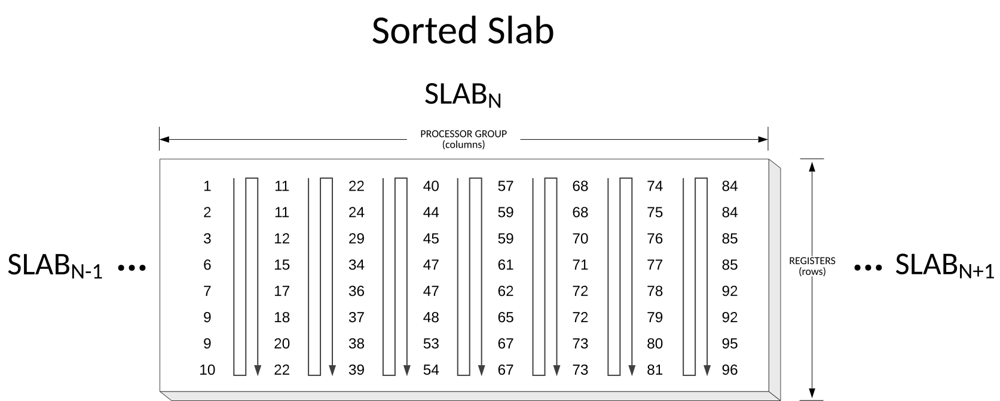
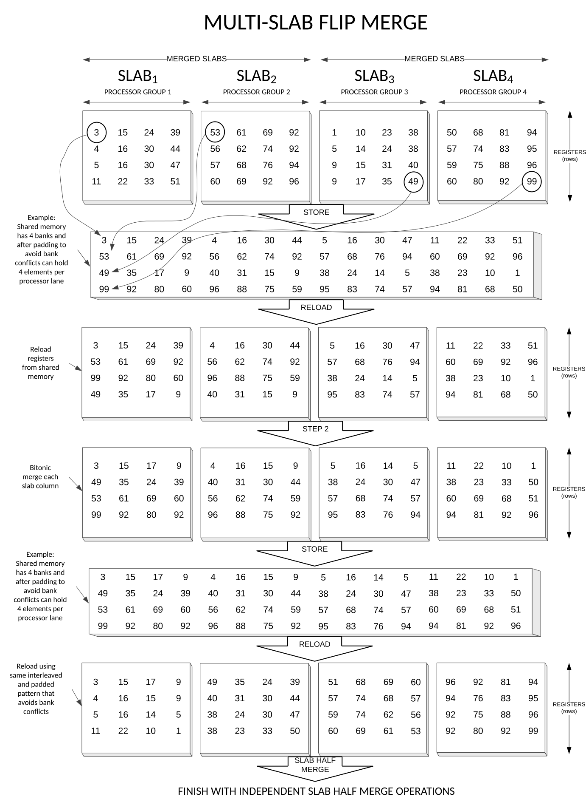

# HotSort

HotSort is a high-performance GPU-accelerated integer sorting library
for Vulkan, CUDA and OpenCL compute APIs.

HotSort's advantages include:

* Ultra-fast sorting of 32‑bit or 64‑bit keys
* Reaches peak throughput on small arrays
* In-place sorting for low-memory environments
* Strong scaling with number of multiprocessors
* Low memory transactions relative to array size
* A concurrency-friendly dense kernel grid
* Support for GPU post-processing of sorted results

HotSort is typically significantly faster than other GPU-accelerated
implementations when sorting arrays of smaller than 500K-2M keys.

## Benchmarks

### Throughput

Here is a throughput plot for HotSort on Vulkan and CUDA sorting
32-bit and 64-bit keys on a 640-core Quadro M1200:




HotSort throughput on Vulkan on an AMD V1807B APU (similar to a Ryzen 2400G) with DDR4-2666 RAM:



HotSort throughput on Vulkan and OpenCL on an Intel HD 630:



### Execution time

Note that these sorting rates translate to sub-millisecond to
multi-millisecond execution times on small GPUs:






# Usage

There are HotSort implementations for Vulkan, CUDA and OpenCL.

Note that HotSort is a comparison sort and supports in-place sorting.

There are also benchmarking examples for the
[Vulkan](vk/bench/main.c), [CUDA](cuda/bench/main.c) and
[OpenCL](cl/bench/main.c) implementations.

*Not all targeted architectures have been tested.*

## Vulkan

The following architectures are supported:

Vendor | Architecture                              | 32‑bit             | 64‑bit             | 32+32‑bit   | Notes
-------|-------------------------------------------|:------------------:|:------------------:|:-----------:|------
NVIDIA | sm_35,sm_37,sm_50,sm_52,sm_60,sm_61,sm_70 | :white_check_mark: | :white_check_mark: | :x:         | Not tested on all architectures
NVIDIA | sm_30,sm_32,sm_53,sm_62                   | :x:                | :x:                | :x:         | Need to generate properly shaped kernels
AMD    | GCN                                       | :white_check_mark: | :white_check_mark: | :x:         | Tested on Linux MESA 18.2
Intel  | GEN8+                                     | :white_check_mark: | :white_check_mark: | :x:         | Good but the assumed *best-shaped* kernels aren't being used due to a compiler issue
Intel  | APL/GLK using a 2x9 or 1x12 thread pool   | :x:                | :x:                | :x:         | Need to generate properly shaped kernels

Add an arch-specific HotSort algorithm (aka "target") to your project
by including a `.c` source and `.h` header file:

Key Size | Source                                                                 | Header
---------|------------------------------------------------------------------------|-------------------------------------------------------
32‑bit   | ```hs/vk/<vendor>/<arch>/u32/hs_<vendor>_<arch>_u32.c``` | ```hs/vk/<vendor>/<arch>/u32/hs_target.h```
64‑bit   | ```hs/vk/<vendor>/<arch>/u64/hs_<vendor>_<arch>_u64.c``` | ```hs/vk/<vendor>/<arch>/u64/hs_target.h```

To sort `count` keys on Vulkan:

```C
#include "hs/vk/intel/gen8/u32/hs_target.h"

...

// create the Vulkan HotSort target
struct hs_vk * hs = hs_vk_create(<address of target>,...);

// allocate a descriptor set from a pool
VkDescriptorSet hs_ds = hs_vk_ds_alloc(hs,descriptor_pool);

...

// command buffer begin

...

// bind buffer(s) to a command buffer
hs_vk_ds_bind(hs,hs_ds,cb,vin,vout); // or (...,vin,VK_NULL_HANDLE) for in-place sorting

// see how much padding may be required
hs_vk_pad(hs,count,&count_padded_in,&count_padded_out);

// append compute shaders to command buffer
hs_vk_sort(hs,cb,...,vin,...,vout,...); // hs_vk_sort() and hs_vk_ds_bind() must have matching vin/vout args

...

// command buffer end and queue submit

...

// release the Vulkan HotSort target
hs_vk_release(hs,...);

```

The [`hs_vk.h`](vk/hs_vk.h) header file describes these functions in
greater detail.

## CUDA

The following architectures are supported:

Vendor | Architecture                                          | 32‑bit             | 64‑bit             | 32+32‑bit | Notes
-------|-------------------------------------------------------|:------------------:|:------------------:|:---------:|------
NVIDIA | sm_35,sm_37,sm_50,sm_52,sm_60,sm_61,sm_70             | :white_check_mark: | :white_check_mark: | :x:       |
NVIDIA | sm_30,sm_32,sm_53,sm_62                               | :x:                | :x:                | :x:       | Need to generate properly shaped kernels

Add an arch-specific HotSort target to your project by including a
`.cu` CUDA source and `.h` header file:

Key Size | Source                                          | Header
---------|-------------------------------------------------|------------------------------------------
32‑bit   | ```hs/cuda/sm_35/u32/hs_cuda_u32.cu``` | ```hs/cuda/sm_35/u32/hs_cuda.h```
64‑bit   | ```hs/cuda/sm_35/u64/hs_cuda_u64.cu``` | ```hs/cuda/sm_35/u64/hs_cuda.h```

Usage on CUDA is very simple.

For example, to sort `count` keys:

```C
#include "hs/cuda/sm_35/u32/hs_cuda.h"

...

uint32_t count_padded_in, count_padded_out;

hs_cuda_pad_u32(count,&count_padded_in,&count_padded_in);

...

hs_cuda_sort_u32(vin,vout, // or (vin,NULL,...) for in-place sorting
                 count,count_padded_in,count_padded_out,
                 true,
                 stream0,stream1,stream2);
```

HotSort on CUDA requires two auxilary streams in order to maximize concurrency.

The algorithm is guaranteed to complete on `stream0`.


## OpenCL

The following architectures are supported:

Vendor | Architecture                            | 32‑bit             | 64‑bit             | 32+32‑bit | Notes
-------|-----------------------------------------|:------------------:|:------------------:|:---------:|------
Intel  | GEN8+                                   | :white_check_mark: | :white_check_mark: | :x:       | Due to a fragile compiler, the assumed best kernels are not being generated at this time
Intel  | APL/GLK using a 2x9 or 1x12 thread pool | :x:                | :x:                | :x:       | Need to generate properly shaped kernels

Add an arch-specific HotSort target to your project by including a
`.c` source and `.h` header file:

Key Size | Source                                                                 | Header
---------|------------------------------------------------------------------------|-------------------------------------------------------
32‑bit   | ```hs/cl/<vendor>/<arch>/u32/hs_<vendor>_<arch>_u32.c``` | ```hs/cl/<vendor>/<arch>/u32/hs_target.h```
64‑bit   | ```hs/cl/<vendor>/<arch>/u64/hs_<vendor>_<arch>_u64.c``` | ```hs/cl/<vendor>/<arch>/u64/hs_target.h```

Note that if the symbol `HS_DUMP_SOURCE` is not defined then the
pre-compiled GEN9 binaries will be included.  These binaries may not
be compatible with all GEN8+ devices and drivers.

To sort `count` keys on OpenCL:

```C
// create the OpenCL HotSort target
struct hs_cl * hs = hs_cl_create(<address of target>,...);

...

// see how much padding may be required
hs_cl_pad(hs,count,&count_padded_in,&count_padded_out);

// enqueue compute kernels
hs_cl_sort(hs,cq,...,vin,vout,...); // or (...,vin,NULL,...) for in-place sorting

...

// release the OpenCL HotSort target
hs_cl_release(hs,...);

```

The [`hs_cl.h`](cl/hs_cl.h) header file describes these functions in
greater detail.

# Background

The HotSort sorting algorithm was created in 2012 and generalized in
2015 to support GPUs that benefit from non-power-of-two workgroups.

The objective of HotSort is to achieve high throughput as *early* as
possible on small GPUs when sorting modestly-sized arrays ― 1,000s to
100s of thousands of 64‑bit keys.

HotSort uses both well-known and obscure properties of bitonic
sequences to create a novel mapping of keys onto data-parallel devices
like GPUs.

## Overview

The overall flow of the HotSort algorithm is below.  Kernel launches
are in italics.

1. For each workgroup of slabs:
   1. For each slab in the workgroup:
      1. *Slab Load*
      1. *Slab Sort*
   1. Until all slabs in the workgroup are merged:
      1. *Multi-Slab Flip Merge*
   1. *Slab Store*
1. Until all slabs are merged:
   1. *Streaming Flip Merge*
   1. If necessary, *Streaming Half Merge*
   1. If necessary, *Multi-Slab Half Merge*
   1. If necessary, *Slab Half Merge*
   1. If complete:
      1. Optionally, *Report Key Changes*
      1. Optionally, *Slab Transpose & Store*
   1. Otherwise: *Slab Store*
1. Done

## Sorting

The algorithm begins with a very *dense* per-multiprocessor block
sorting algorithm that loads a "slab" of keys into a subgroup's
registers, sorts the slabs, merges all slabs in the workgroup, and
stores the slabs back to global memory.

In the slab sorting phase, each lane of a subgroup executes a bitonic
sorting network on its registers and successively merges lanes until
the slab of registers is sorted in serpentine order.



## Merging

HotSort has several different merging strategies.

The merging kernels leverage the multiprocessor's register file by
loading, merging and storing a large number of strided slab rows
without using local memory.

The merging kernels exploit the bitonic sequence property that
interleaved subsequences of a bitonic sequence are also bitonic
sequences.  This property also holds for non-power-of-two sequences.

As an example, the *Streaming Flip Merge* kernel is illustrated below:



# Future Enhancements

## Hybrid improved merging

HotSort's initial sorting and merging phases are performed on bitonic
sequences.  Because of this, throughput decreases as the problem size
increases.

A hybrid algorithm that combined HotSort's block sorter and several
rounds of merging with a state-of-the-art GPU merging algorithm would
probably improve the algorithm's performance on larger arrays.

## Reenable support for devices lacking shuffle functions

The original version of HotSort ran on pre-Kepler GPUs without
intra-warp/inter-lane shuffling ― reenable this capability.

## Metal support

Modify the HotSort generator to support Metal targets.
