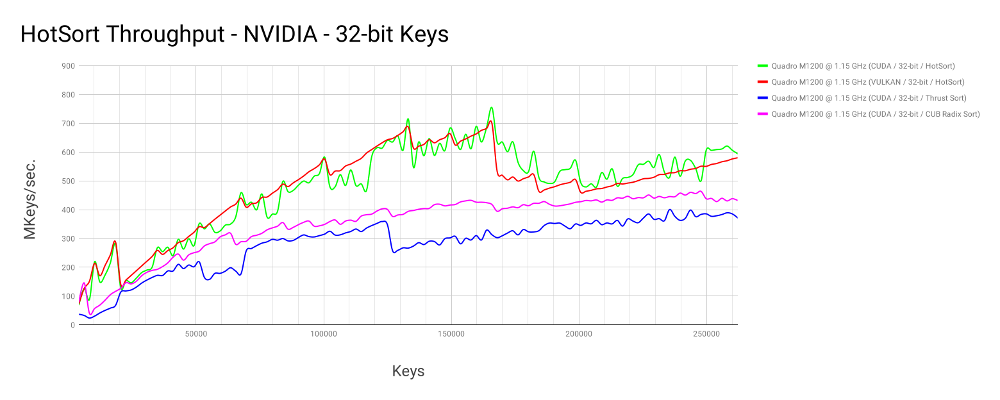
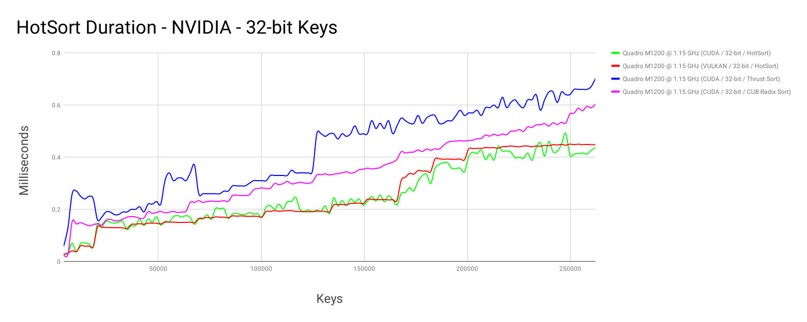
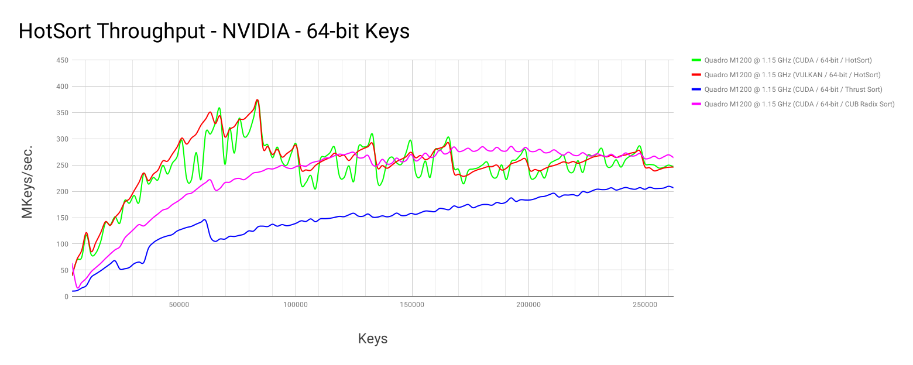
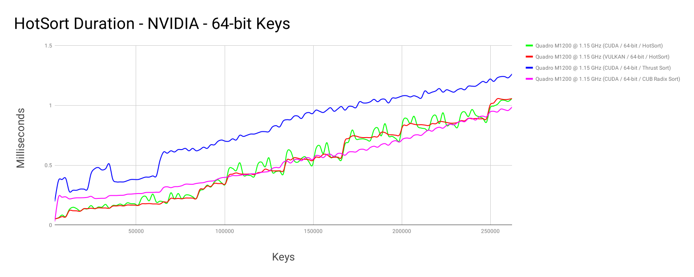
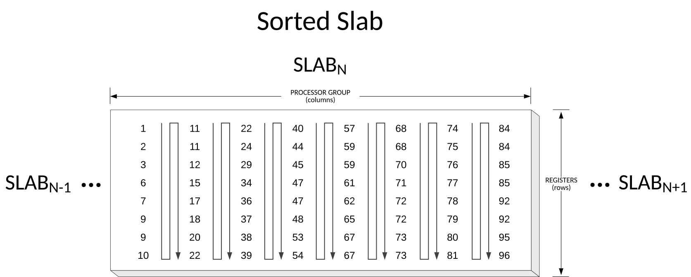
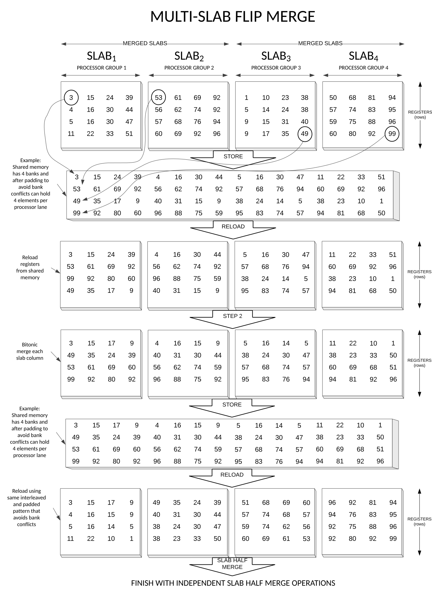

# HotSort

HotSort is a high-performance GPU-accelerated integer sorting library
for Vulkan, CUDA and OpenCL GPUs.

HotSort's advantages include:

* An ultra-fast algorithm for sorting 32‑bit and 64‑bit keys
* Reaches peak throughput on small arrays
* In-place sorting for low-memory environments
* Strong scaling with number of multiprocessors
* Low memory transactions relative to array size
* A concurrency-friendly dense kernel grid
* Support for GPU post-processing of sorted results

The HotSort sorting kernels are typically significantly faster than
other GPU sorting implementations when sorting arrays of smaller than
500K-2M keys.

Below is a plot of HotSort on CUDA and Vulkan sorting 32-bit keys:

Below is a plot of HotSort on CUDA and Vulkan sorting 64-bit keys:

# Usage

There are HotSort implementations for Vulkan, CUDA and OpenCL.

Not all targeted architectures have been tested.

## Vulkan

The following architectures should work with the pre-compiled targets.

Vendor | Architecture                              | 32‑bit             | 64‑bit             | 32+32‑bit   | Notes
-------|-------------------------------------------|:------------------:|:------------------:|:-----------:|------
NVIDIA | sm_35,sm_37,sm_50,sm_52,sm_60,sm_61,sm_70 | :white_check_mark: | :white_check_mark: | :x:         | Performance matches CUDA
NVIDIA | sm_30,sm_32,sm_53,sm_62                   | :x:                | :x:                | :x:         | Need to generate properly shaped kernels
AMD    | GCN                                       | :x:                | :x:                | :x:         | TODO
Intel  | GEN8+                                     | :white_check_mark: | :white_check_mark: | :x:         | Due to a fragile compiler, the assumed best kernels are not being generated at this time
Intel  | APL/GLK using a 2x9 or 1x12 thread pool   | :x:                | :x:                | :x:         | Need to generate properly shaped kernels

## CUDA

The following architectures should work with the pre-compiled targets.

Vendor | Architecture                                          | 32‑bit             | 64‑bit             | 32+32‑bit | Notes
-------|-------------------------------------------------------|:------------------:|:------------------:|:---------:|------
NVIDIA | sm_35,sm_37,sm_50,sm_52,sm_60,sm_61,sm_70             | :white_check_mark: | :white_check_mark: | :x:       |
NVIDIA | sm_30,sm_32,sm_53,sm_62                               | :x:                | :x:                | :x:       | Need to generate properly shaped kernels

## OpenCL

The following architectures should work with the pre-compiled targets.

Vendor | Architecture                            | 32‑bit             | 64‑bit             | 32+32‑bit | Notes
-------|-----------------------------------------|:------------------:|:------------------:|:---------:|------
Intel  | GEN8+                                   | :white_check_mark: | :white_check_mark: | :x:       | Due to a fragile compiler, the assumed best kernels are not being generated at this time
Intel  | APL/GLK using a 2x9 or 1x12 thread pool | :x:                | :x:                | :x:       | Need to generate properly shaped kernels

# Background

The HotSort sorting algorithm was created in 2012 and generalized in
2015 to support GPUs that benefit from non-power-of-two workgroups.

The goal of HotSort was to achieve high throughput as *early* as
possible on small GPUs when sorting modestly-sized arrays ― 1,000s to
100s of thousands of 64‑bit keys.

## Overview

The overall flow of the HotSort algorithm is below.  Kernel launches
are in italics.

1. For each workgroup of slabs:
   1. For each slab in the workgroup:
      1. *Slab Load*
      1. *Slab Sort*
   1. Until all slabs in the workgroup are merged:
      1. *Multi-Slab Flip Merge*
   1. *Slab Store*
1. Until all slabs are merged:
   1. *Streaming Flip Merge*
   1. If necessary, *Streaming Half Merge*
   1. If necessary, *Multi-Slab Half Merge*
   1. If necessary, *Slab Half Merge*
   1. If complete:
      1. Optionally, *Report Key Changes*
      1. Optionally, *Slab Transpose & Store*
   1. Otherwise: *Slab Store*
1. Done

## Sorting

The algorithm begins with a very *dense* per-multiprocessor block
sorting algorithm that loads a "slab" of keys into a subgroup's
registers, sorts the slabs, merges all slabs in the workgroup, and
stores the slabs back to global memory.

In the slab sorting phase, each lane of a subgroup executes a bitonic
sorting network on its registers and successively merges lanes until
the slab of registers is sorted in serpentine order.

## Merging

HotSort has several different merging strategies.

The merging kernels leverage the multiprocessor's register file by
loading, merging and storing a large number of strided slab rows
without using local memory.

The merging kernels exploit the bitonic sequence property that
interleaved subsequences of a bitonic sequence are also bitonic
sequences.

As an example, the *Streaming Flip Merge* kernel is illustrated below:

# Enhancements

## Hybrid improved merging

HotSort's initial sorting and merging phases are performed on bitonic
sequences.  Because of this, throughput decreases as the problem size
increases.

A hybrid algorithm that combined HotSort's block sorter and several
rounds of merging with a state-of-the-art GPU merging algorithm would
probably improve the algorithm's performance on larger arrays.

## Reenable support for devices lacking shuffle functions

The original version of HotSort ran on pre-Kepler GPUs without
intra-warp/inter-lane shuffling ― reenable this capability.

## Metal support

Modify the HotSort generator to support Metal targets.
