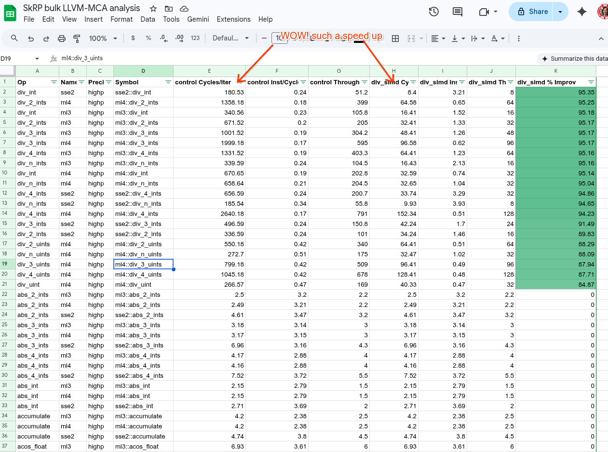

Toolkit for working with SkRasterPipeline (SkRP)

# Background

SkRasterPipeline is Skia's CPU rendering backend. It executes a "program" which is a sequence of pre-compiled "stages". See src/opts/SkRasterPipeline_opts.h for the stage code.

## SIMD Namespaces
Skia compiles the same stage logic for multiple CPU architectures and chooses the best at runtime. See src/opts/SkOpts_ml4.cpp for an example of how those stages are compiled for a specific architecture. In a binary, you will see symbols prefixed with these namespaces:
- `ml3`, `ml4`: Modern x86 (Microarchitecture Levels 3/4, e.g., AVX2, AVX-512).
- `sse2`, `sse41`, `avx`: Older x86 generations.
- `neon`: ARM NEON.
- `scalar`: Portable fallback logic (non-SIMD).

## Precision Modes
- **Highp (High Precision)**: Uses `float` (32-bit) for all calculations. Slower but more accurate. Used for complex shaders and wide-gamut colors.
- **Lowp (Low Precision)**: Uses fixed-point (16-bit) math. Significantly faster. Most standard drawing operations use lowp.

## Symbol Naming Convention
- **Highp**: `{namespace}::{op}` (e.g., `ml4::gather_8888`)
- **Lowp**: `{namespace}::lowp::{op}` (e.g., `ml4::lowp::gather_8888`)

# llvm-mca analysis helper

## System Requirements
To use this script, you will need the following tools installed:
- `nm` and `objdump` (usually part of `binutils`)
- `llvm-mca` (version 19+ recommended for best results)

We can use `llvm-mca` to simulate running a block of assembly code and see how many cycles it takes. SkRP is made up of over 500 stages and it would be difficult to know how changing a helper function would impact various stages across all the different instruction sets. The `llvm_mca_analysis.py` script looks at a compiled binary or .so file, extracts the assembly bits for each stage, runs `llvm-mca` over each of these and puts the summaries into a .tsv file which can be imported into Sheets or similar for analysis.

This doesn't replace running benchmarks, but can supplement them for getting a sense of the theoretical speedup or performance tradeoffs for a change.



## Example use with Skia

Recommended GN args for Skia:
```
# Release mode
is_debug = false
# With gcc, your milage and generated assembly may vary
cc="clang"
cxx="clang++"
```

Compile Skia, extract the control assembly and analysis, then make the change, recompile, and reanalyze. Subsequent calls to the same work_dir will append to the data and compute a percent improvement from the first data (assumed to be the control).
```
skia$ ninja -C out/Release nanobench
$ python3 llvm_mca_analysis.py --bin /path/to/skia/out/Release/nanobench --work_dir out/perf/skia --name control
Scanning . for RP stages...
Found 525 potential stages.
Discovering symbols in /path/to/skia/out/Release/nanobench...
Found 1890 compiled stages.
Results written to out/perf/skia/analysis.tsv
# Apply changes
skia$ ninja -C out/Release nanobench
$ python3 llvm_mca_analysis.py --bin /path/to/skia/out/Release/nanobench --work_dir out/perf/skia --name with_change
...
```

## Example use with Chromium

Recommended GN args for Chromium:
```
use_remoteexec=true

is_debug = false
symbol_level = 1
blink_symbol_level = 1
is_component_build = true
use_thin_lto = true
dcheck_always_on = false
```
The LTO (link-time optimization) is important. The key flag for development cycles is the `is_component_build = true` which means we don't have to build and link and optimize the entire `chrome` binary, just `libskia.so`. I keep this in `out/Profile` so I still have `out/Release` to run benchmarks.

```
chromium $ autoninja -C out/Profile/ skia
$ python3 llvm_mca_analysis.py --bin /path/to/chrome/out/Profile/libskia.so --work_dir out/perf/chrome --name control
...
# Apply changes
chromium $ autoninja -C out/Profile/ skia
$ python3 llvm_mca_analysis.py --bin /path/to/chrome/out/Profile/libskia.so --work_dir out/perf/chrome --name with_change
...
```

## Performance Metrics

### Cycles/Iteration
The most direct measure of performance. It represents the estimated CPU cycles to process one "pixel block" (e.g., 8 pixels on AVX2 [high precision], 16 on AVX-512).

### IPC (Instructions Per Cycle)
Measures pipeline utilization. A higher IPC (closer to the CPU's dispatch width) means the code is executing efficiently. Low IPC often indicates stalls due to long-latency instructions (like `div` or `gather`) or data dependencies.

### Block RThroughput (Reciprocal Throughput)
The theoretical performance limit if the execution units were fully saturated. If `Cycles/Iteration` is much higher than `Block RThroughput`, the stage is likely bottlenecked by instruction latency or port contention rather than raw throughput.

## Options
```
$ python3 llvm_mca_analysis.py --help
usage: llvm_mca_analysis.py [-h] --bin BIN --name NAME --work_dir WORK_DIR [--skia_root SKIA_ROOT] [--mcpu MCPU] [--mca_path MCA_PATH] [--list-stages]

Analyze SkRasterPipeline stage performance.

options:
  -h, --help            show this help message and exit
  --bin BIN             Path to the binary to analyze.
  --name NAME           Name for this run (e.g. control, experiment).
  --work_dir WORK_DIR   Directory to store assembly and results.
  --skia_root SKIA_ROOT Path to Skia root directory.
  --mcpu MCPU           CPU model for llvm-mca.    # e.g. "x86-64-v4" for generic AVX512 hardware
  --mca_path MCA_PATH   Path to llvm-mca.
  --list-stages         Just list found stages and exit.
```

### Common MCPU Values
When using the `--mcpu` flag, you should specify the architecture that matches the hardware that has the regression. Example values include:
- `x86-64-v3`: Generic AVX2-capable x86 (e.g., Haswell and newer).
- `x86-64-v4`: Generic AVX-512-capable x86 (e.g., Skylake-X and newer).
- `apple-m1`, `apple-m2`: Apple Silicon.
